# Entrega 2 — Público-alvo e análise de concorrência

**Data:** 26/08/2026  
**Status:** 🟩 concluída 
**Responsabilidade mínima:** cada integrante analisa pelo menos 1 concorrente/interface representativa; a equipe produz síntese comparativa.

## Objetivo da atividade

Compreender soluções do mesmo domínio **e também interfaces familiares ao público-alvo**. O objetivo não é copiar telas, mas identificar convenções, padrões, affordances percebidas, problemas recorrentes, expectativas e oportunidades de design.

> **Concorrente não precisa ser idêntico ao produto.** Pode atuar na mesma área, resolver objetivo semelhante ou disputar a mesma necessidade. Quando não houver concorrente direto, use produtos análogos e softwares que o público já utiliza.

### Para TCCs que não previam interface

Não procure apenas um “concorrente do algoritmo”. Investigue **interfaces profissionais que materializam atividades semelhantes** às que o usuário escolhido precisaria realizar.

Exemplos:

- TCC de banco de dados → consoles de administração, ferramentas para DBA, monitoramento e análise de consultas;
- TCC de LLM/ML → painéis de experimentos, gestão de modelos/datasets, comparação de métricas, revisão de resultados;
- TCC de análise de dados → dashboards, ferramentas de BI, filtros, relatórios e exploração;
- TCC de infraestrutura/API → portais administrativos, observabilidade, logs, gestão de credenciais e uso;
- TCC de cibersegurança → consoles de alertas, triagem, histórico e auditoria.

A pergunta é: **“que convenções esse perfil já conhece para executar tarefas equivalentes?”**

## Entrada obrigatória da Entrega 1

Retome o mapa inicial de alternativas e produtos citado na Entrega 1. Aqui a equipe deixa de trabalhar apenas com impressão inicial e passa a **investigar sistematicamente** cada solução.

| Item citado na Entrega 1 | Tipo | Por que foi citado | Status inicial | Decisão nesta entrega |
|---|---|---|---|---|
| Site, páginas e documentos institucionais da FEI | ferramenta cotidiana | São meios disponíveis para consulta de informações acadêmicas, administrativas, serviços, regras e orientações institucionais | F | analisar |
| Portal e sistemas acadêmicos da instituição | ferramenta cotidiana | Fazem parte do ambiente digital utilizado pelos estudantes para consultar informações e realizar atividades relacionadas à vida acadêmica | F | analisar de forma complementar |
| Canais de atendimento e contato com profissionais da instituição | processo manual | Representam uma alternativa para o estudante buscar esclarecimentos sobre dúvidas acadêmicas e administrativas | F | analisar de forma complementar |
| Mecanismos de busca na Internet | ferramenta cotidiana / análogo | Podem ser utilizados para localizar páginas, documentos ou informações relacionadas a uma dúvida | H | analisar de forma complementar |
| Assistentes de IA de propósito geral, como ChatGPT, Gemini e Copilot | análogo | Permitem realizar perguntas em linguagem natural e obter respostas ou orientações, apresentando um modelo de interação semelhante ao proposto no TCC | H | analisar |

Se uma hipótese da Entrega 1 for confirmada ou refutada durante esta análise, atualize `H01`, `H02`... em [`../RASTREABILIDADE.md`](../RASTREABILIDADE.md).

## 1. Público-alvo desta análise

O público-alvo prioritário desta análise é composto por estudantes da FEI que precisam localizar e compreender informações acadêmicas ou administrativas, como regras, prazos, serviços, orientações institucionais e procedimentos relacionados à vida acadêmica.

Esse público retoma o recorte definido na Entrega 1, na qual o estudante da FEI foi identificado como o usuário direto prioritário do projeto de IHC. Entre as principais atividades consideradas estão a localização e compreensão de informações acadêmico-administrativas e o entendimento de como realizar determinados procedimentos.

Nesta entrega, as soluções serão analisadas considerando principalmente como suas interfaces apoiam atividades de busca, formulação de dúvidas, compreensão de respostas, apresentação de informações e orientação do usuário, além dos padrões de interação que possam ser familiares ou relevantes para esse público.

## 2. Concorrentes diretos/indiretos

### Análise C01 — ChatGPT

**Autor(a):** João Pedro Sabino Garcia — 22.224.032-7  
**Tipo:** análogo  
**Link oficial:** [ChatGPT — OpenAI](https://chatgpt.com/)  
**Data de acesso:** 26/08/2026

#### Contexto e proposta

O ChatGPT é um assistente de Inteligência Artificial de propósito geral que permite ao usuário formular perguntas e solicitações em linguagem natural e receber respostas em formato conversacional. A ferramenta pode manter o contexto de uma conversa, receber diferentes tipos de entrada e, quando utiliza pesquisa na web, apresentar citações e links relacionados às fontes consultadas.

Embora não tenha sido desenvolvido especificamente para responder dúvidas acadêmicas e administrativas da FEI, o ChatGPT é relevante como produto análogo por utilizar um modelo de interação semelhante ao proposto no TCC: o usuário apresenta uma dúvida em linguagem natural, recebe uma resposta e pode continuar a interação com novas perguntas.

Para o projeto de IHC, sua análise é especialmente útil para observar padrões de interface conversacional, apresentação de respostas, continuidade do diálogo, acesso a fontes e tratamento de diferentes tipos de entrada.

#### Funcionalidades relevantes

| Funcionalidade | Como é realizada | Evidência/print | Observação de IHC |
|---|---|---|---|
| Formulação de perguntas em linguagem natural | O usuário digita sua solicitação em um campo de texto e envia a mensagem para iniciar ou continuar a conversa | 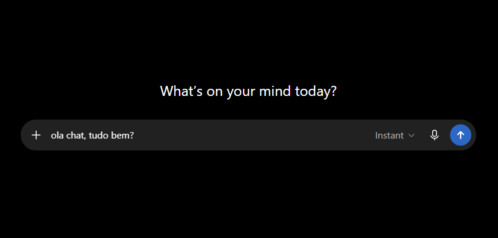 | O campo de entrada concentra a principal ação da interface e permite que o usuário formule a dúvida com suas próprias palavras |
| Resposta em formato conversacional | A resposta é apresentada na sequência da pergunta, mantendo a estrutura de diálogo entre usuário e assistente | 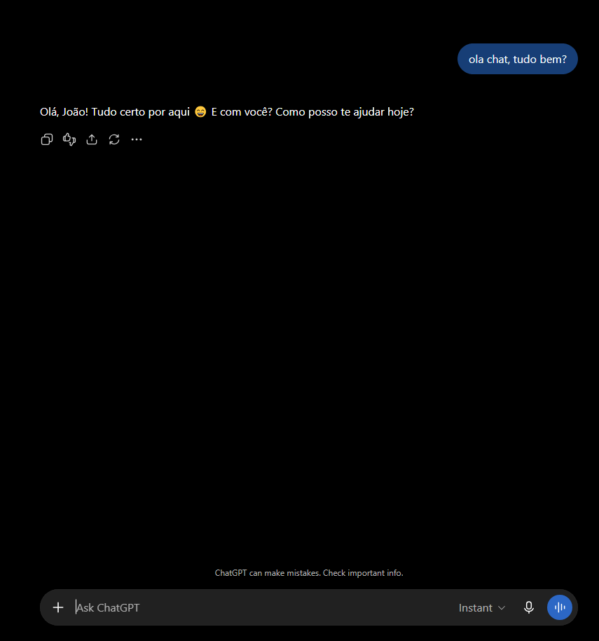 | A associação visual entre pergunta e resposta facilita o acompanhamento da interação e permite perguntas complementares |
| Continuidade da conversa | O usuário pode realizar novas perguntas no mesmo diálogo, utilizando o contexto das mensagens anteriores | 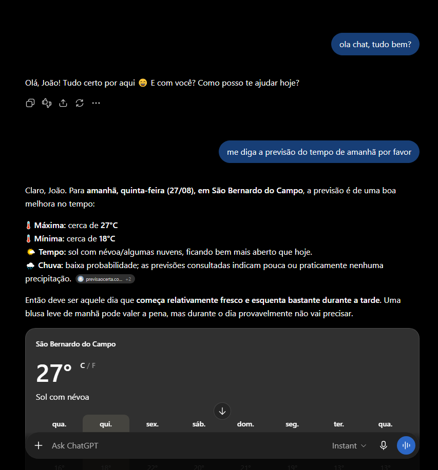 | Reduz a necessidade de repetir todo o contexto e permite refinar uma pergunta quando a primeira resposta não é suficiente |
| Apresentação de fontes em respostas com pesquisa na web | Quando a pesquisa na web é utilizada, a resposta pode apresentar citações associadas às informações utilizadas e uma área para consulta das fontes | 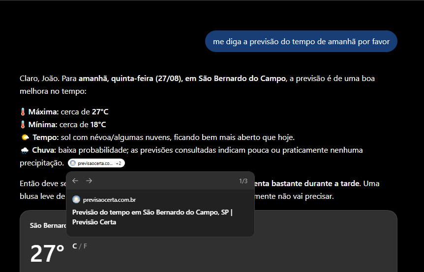 | A presença de fontes fornece um caminho para que o usuário consulte a origem de determinada informação, padrão especialmente relevante para o TCC |
| Histórico de conversas | Conversas anteriores podem ser retomadas posteriormente por meio da navegação da interface | 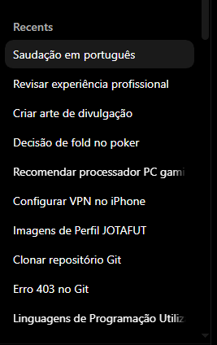 | Pode facilitar a retomada de uma consulta anterior, embora a necessidade desse recurso para os estudantes da FEI ainda precise ser investigada |

#### Experiência do usuário e opiniões

Estudos com estudantes universitários indicam que a facilidade de uso e a rapidez das respostas estão entre os aspectos positivamente percebidos no uso do ChatGPT. Um estudo publicado em 2025 identificou avaliações positivas para facilidade de uso, rapidez das respostas, disponibilidade e experiência amigável, além da possibilidade de realizar perguntas complementares.

Uma pesquisa multi-institucional publicada em 2026 também identificou que estudantes valorizam o acesso rápido à informação e a possibilidade de esclarecer conceitos. Entretanto, o mesmo estudo registrou preocupações relacionadas a respostas incorretas, dependência excessiva da ferramenta e limitações das versões gratuitas.

Outros estudos sobre uso de ChatGPT no ensino superior também relatam experiências positivas relacionadas à rapidez e facilidade de interação, mas apontam como limitações a ocorrência de imprecisões, dificuldades em determinadas perguntas e necessidade de avaliação crítica das respostas.

Para o projeto, essas evidências indicam que a simplicidade da interação conversacional pode ser uma referência relevante, mas que a facilidade de obter uma resposta não deve ser confundida com garantia de que a informação apresentada esteja correta ou seja adequada ao contexto institucional.

#### Preço/modelo de negócio

O ChatGPT adota um modelo **freemium**, oferecendo uma versão gratuita com limites de utilização e planos pagos que ampliam o acesso a modelos e funcionalidades.

Na data desta análise, o plano ChatGPT Plus é oferecido por **US$ 20 por mês**, enquanto também existem outras modalidades destinadas a diferentes níveis de uso e a organizações.

Para esta análise de IHC, o aspecto mais relevante não é o preço específico dos planos, mas o fato de que determinadas funcionalidades e limites de utilização podem variar conforme a modalidade de acesso do usuário.

#### Padrões e tendências percebidos

Os principais padrões de interação observados são:

- campo de texto como elemento central para iniciar a interação;
- uso de linguagem natural como principal forma de entrada;
- organização da interação em formato de conversa;
- permanência do contexto para realização de perguntas complementares;
- apresentação progressiva de pergunta e resposta em uma mesma sequência;
- possibilidade de consultar fontes quando a resposta utiliza pesquisa externa;
- histórico para retomada de conversas anteriores;
- possibilidade de anexar arquivos e utilizar diferentes formas de entrada.

Esses padrões reduzem a necessidade de o usuário aprender uma estrutura complexa de navegação antes de realizar sua principal tarefa. Entretanto, nem todos devem ser automaticamente incorporados ao projeto da FEI, sendo necessário avaliar sua relação com as atividades A01 e A02 definidas na Entrega 1.

#### Pontos positivos, limitações e lições

| Ponto | Evidência | Implicação para nosso projeto |
|---|---|---|
| A interação principal pode ser iniciada diretamente por uma pergunta em linguagem natural | Interface do ChatGPT e documentação oficial | Manter uma forma simples e evidente para o estudante formular sua dúvida pode reduzir etapas desnecessárias antes da tarefa principal |
| A conversa permite perguntas complementares mantendo o contexto anterior | Observação da interface | Pode ser interessante permitir que o estudante refine ou complemente uma dúvida sem precisar reiniciar toda a consulta |
| Respostas provenientes de pesquisa podem apresentar citações e acesso às fontes | Documentação oficial e print da interface | A apresentação da fonte institucional associada à resposta é especialmente relevante para o TCC, no qual a fundamentação documental é parte central da solução |
| Estudos com universitários apontam rapidez e facilidade de uso como aspectos positivos | Estudos sobre percepção e utilização do ChatGPT no ensino superior | A interface do projeto deve priorizar um fluxo de consulta simples, com baixa quantidade de etapas entre formular a dúvida e compreender a resposta |
| Estudos também relatam preocupação com imprecisões e confiança nas respostas | Estudos sobre uso do ChatGPT no ensino superior | O projeto deve deixar claro o escopo da informação, utilizar fontes institucionais e tratar explicitamente situações em que não existe evidência suficiente para responder |
| O histórico permite retomar conversas anteriores | Interface do ChatGPT | Pode ser uma possibilidade de interação para o projeto, mas não deve ser considerada requisito até que sua utilidade para os estudantes seja investigada |

### Análise C02 — Google Gemini

**Autor(a):** Matheus Dourado Valle — 22.224.023-6  
**Tipo:** análogo  
**Link oficial:** [Gemini — Google](https://gemini.google.com/)  
**Data de acesso:** 04/09/2026

#### Contexto e proposta

O Google Gemini é um assistente de Inteligência Artificial de propósito geral que permite ao usuário formular perguntas e solicitações em linguagem natural e receber respostas em formato conversacional.

Embora não tenha sido desenvolvido especificamente para responder dúvidas acadêmicas e administrativas da FEI, o Gemini é relevante como produto análogo por apresentar um modelo de interação semelhante ao proposto no nosso TCC: o usuário formula uma dúvida por meio de linguagem natural, recebe uma resposta textual e pode continuar a interação realizando perguntas complementares.

Além da interação conversacional, a interface permite acessar conversas anteriores e, em determinadas respostas, consultar fontes e conteúdos relacionados apresentados pelo sistema. Esses elementos tornam o Gemini uma referência útil para analisar padrões de interação, feedback, continuidade da conversa e apresentação da origem das informações.

#### Funcionalidades relevantes

| Funcionalidade | Como é realizada | Evidência/print | Observação de IHC |
|---|---|---|---|
| Formulação de perguntas em linguagem natural | O usuário digita sua pergunta ou solicitação em um campo de texto e envia para iniciar ou continuar uma conversa | 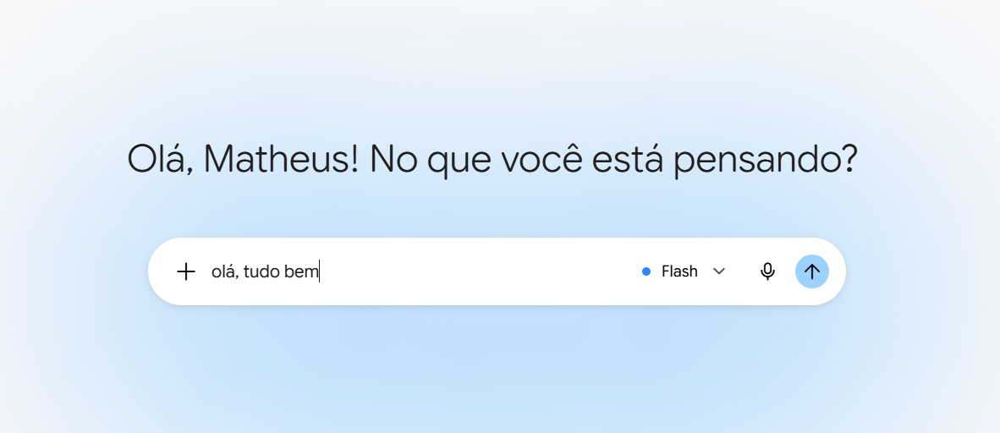 | O campo de entrada concentra a principal ação da interface e permite que o usuário expresse sua necessidade utilizando suas próprias palavras |
| Resposta em formato conversacional | O Gemini apresenta uma resposta textual associada à pergunta realizada pelo usuário | 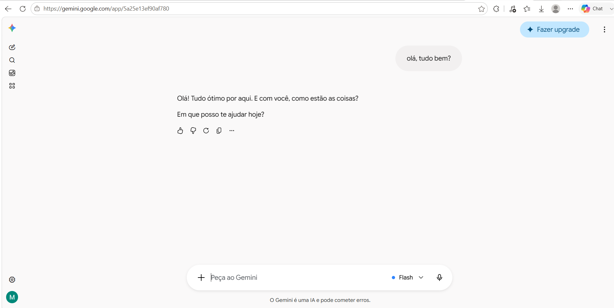 | O formato de diálogo aproxima pergunta e resposta e facilita a continuidade da interação |
| Continuidade da conversa | O usuário pode realizar novas perguntas dentro da mesma conversa, utilizando o contexto das mensagens anteriores | 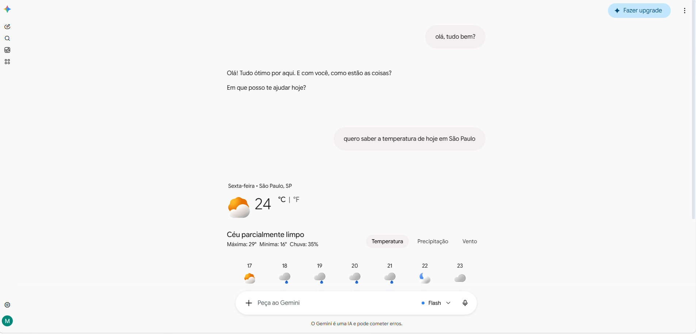 | Permite esclarecer, complementar ou reformular uma dúvida sem necessariamente repetir todo o contexto |
| Apresentação de fontes e conteúdos relacionados | Em determinadas respostas, o Gemini apresenta referências e links associados às informações fornecidas, permitindo que o usuário consulte as fontes relacionadas | 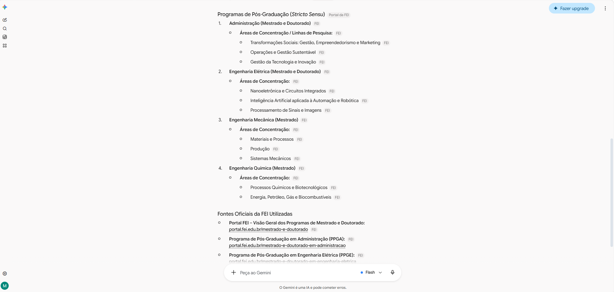 | A apresentação de fontes favorece a transparência sobre a origem das informações, aspecto especialmente relevante para um assistente baseado em fontes institucionais |
| Histórico de conversas | Conversas anteriores podem ser acessadas e retomadas por meio da área de conversas recentes e da pesquisa de conversas | 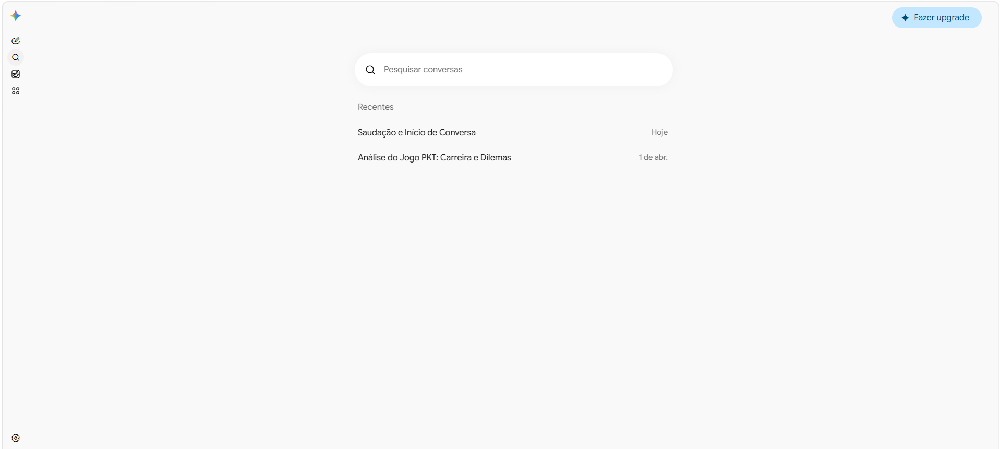 | Facilita a retomada de consultas anteriores, embora a necessidade desse recurso no contexto da FEI ainda precise ser investigada |

#### Experiência do usuário e opiniões

A análise foi realizada a partir de um teste exploratório da interface e da documentação oficial do Google Gemini.

A interface concentra a principal interação em um campo para entrada de texto, permitindo que o usuário comece a consulta sem precisar navegar por uma estrutura complexa de menus. Após a resposta inicial, novas perguntas podem ser realizadas na mesma conversa, possibilitando refinamento ou complementação da solicitação.

Outro aspecto relevante para o nosso projeto é a possibilidade de o Gemini apresentar fontes e conteúdos relacionados em determinadas respostas. Entretanto, esse recurso não está presente obrigatoriamente em todas as respostas, o que significa que a disponibilidade de uma fonte não deve ser considerada um comportamento garantido da interface.

A própria interface do Gemini informa que a Inteligência Artificial pode cometer erros, e a documentação oficial orienta o usuário a considerar essa possibilidade. Esse aspecto é particularmente relevante para o nosso TCC, pois dúvidas acadêmicas e administrativas podem envolver regras, prazos e procedimentos institucionais.

Assim, o Gemini demonstra vantagens relacionadas à simplicidade da interação e à possibilidade de continuidade da conversa, mas também evidencia a necessidade de mecanismos de transparência e controle da informação quando o sistema é utilizado em um domínio institucional específico.

#### Preço/modelo de negócio

O Google Gemini utiliza um modelo de acesso que combina utilização sem um plano de IA com planos pagos do Google AI.

Usuários sem um plano de IA possuem acesso aos recursos do Gemini sujeitos a limites padrão, enquanto os planos pagos oferecem limites ampliados e acesso adicional a determinados modelos e funcionalidades.

Para esta análise de IHC, o aspecto mais relevante não é o valor específico dos planos, mas a existência de diferenças de acesso e disponibilidade de funcionalidades conforme a modalidade utilizada pelo usuário.

#### Padrões e tendências percebidos

Os principais padrões de interação observados são:

- campo de texto como principal ponto de entrada da interação;
- uso de linguagem natural;
- respostas organizadas em formato conversacional;
- possibilidade de continuidade da conversa por meio de perguntas complementares;
- acesso e pesquisa de conversas anteriores;
- apresentação de fontes ou conteúdos relacionados em determinadas respostas;
- possibilidade de reformular ou aprofundar uma consulta dentro do mesmo diálogo.

Esses padrões possuem relação com as atividades A01 e A02 definidas na Entrega 1, pois permitem que o estudante formule uma dúvida sem precisar conhecer previamente a localização da informação e complemente a consulta quando a primeira resposta não for suficiente.

Entretanto, a adoção desses padrões no assistente da FEI deve considerar o contexto específico do projeto. Recursos presentes no Gemini, como histórico de conversas, não devem ser tratados automaticamente como requisitos sem uma necessidade identificada entre os estudantes.

#### Pontos positivos, limitações e lições

| Ponto | Evidência | Implicação para nosso projeto |
|---|---|---|
| Permite iniciar uma consulta diretamente em linguagem natural | Interface do Gemini e print da pergunta | Reforça a possibilidade de manter a formulação da dúvida como ação principal da interface, evitando etapas desnecessárias |
| Permite realizar perguntas complementares mantendo o contexto da conversa | Interface do Gemini e print de continuidade | O assistente da FEI pode permitir que o estudante refine ou complemente uma dúvida sem precisar reiniciar a consulta |
| Pode apresentar fontes e conteúdos relacionados às respostas | Interface, print das fontes e documentação oficial do Gemini | Reforça a importância de apresentar de forma clara as fontes institucionais relacionadas às respostas do nosso assistente |
| Mantém acesso e pesquisa de conversas anteriores | Interface do Gemini e print do histórico | O histórico pode ser considerado como possibilidade de interação, mas sua necessidade para o público da FEI ainda deverá ser investigada |
| Nem todas as respostas apresentam fontes | Documentação oficial e teste da interface | No nosso projeto, a apresentação da origem institucional da informação deve ser tratada de forma mais controlada por fazer parte da proposta de fundamentação documental |
| O Gemini informa que respostas produzidas por IA podem conter erros | Interface e documentação oficial do Gemini | Reforça a necessidade de o assistente da FEI reconhecer situações em que não há evidência suficiente e evitar respostas sem sustentação institucional |
| É um assistente de propósito geral e não específico da FEI | Escopo do produto | O nosso projeto pode se diferenciar ao restringir as respostas ao domínio acadêmico-administrativo e às fontes institucionais selecionadas da FEI |

## 3. Softwares que o público-alvo usa no cotidiano

Como ainda não foi realizado um levantamento direto sobre quais ferramentas são mais utilizadas pelos estudantes da FEI, foram selecionadas interfaces presentes no contexto acadêmico ou plausivelmente familiares ao público-alvo. A análise busca identificar padrões de interação que possam influenciar as expectativas dos estudantes ao utilizar o assistente proposto.

| Software | Por que o público usa | Padrões relevantes | Prints | O que aprender |
|---|---|---|---|---|
| Portal do Aluno / sistemas acadêmicos da FEI | Permitem consultar informações e realizar atividades relacionadas à vida acadêmica | Navegação por menus, organização das informações por categorias e acesso a diferentes serviços acadêmicos | 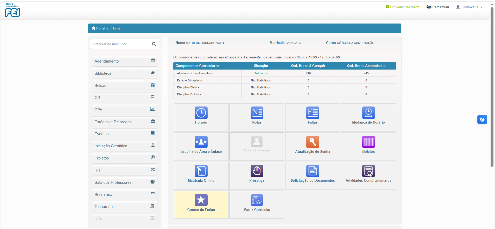 | Observar como informações e serviços acadêmicos já são organizados e nomeados no ambiente institucional, mantendo vocabulário familiar ao estudante |
| Moodle | É utilizado pelos estudantes para acessar conteúdos, atividades, avisos e informações relacionadas às disciplinas | Organização por disciplinas, navegação por seções, avisos, prazos, atividades e identificação das informações conforme o contexto da disciplina | 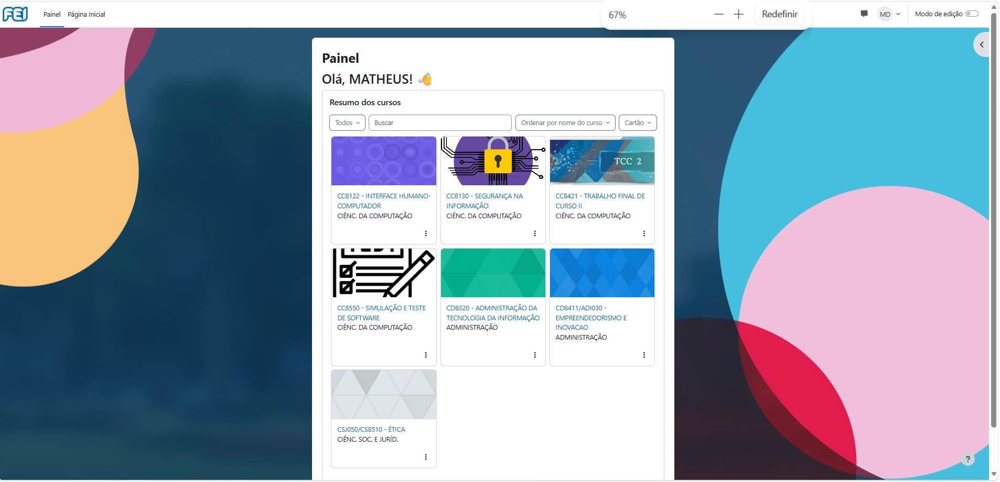 | Observar como os estudantes já localizam informações acadêmicas em uma estrutura conhecida e quais padrões de organização, nomenclatura e navegação podem reduzir a necessidade de aprendizado de uma nova interface |
| ChatGPT | Permite formular perguntas em linguagem natural e receber respostas em formato conversacional | Campo de entrada de texto, sequência de mensagens, continuidade da conversa, histórico e apresentação de fontes em determinados tipos de resposta |  | A interação conversacional pode reduzir a necessidade de o usuário conhecer previamente onde a informação está localizada, além de permitir refinamento da dúvida por meio de novas perguntas |

## 3.1 Padrões de interface relevantes ao escopo de IHC

| Padrão observado | Produto(s) | Para qual tarefa serve | Vantagem percebida | Risco/limitação | Aplicável ao nosso escopo? |
|---|---|---|---|---|---|
| Campo de entrada em linguagem natural | ChatGPT e Gemini | Permitir que o usuário formule diretamente uma dúvida ou solicitação | Reduz a necessidade de conhecer previamente menus, categorias ou o local exato em que a informação está disponível | Perguntas muito vagas ou ambíguas podem produzir respostas pouco adequadas | Sim |
| Interação em formato conversacional | ChatGPT e Gemini | Apoiar a compreensão da informação e permitir perguntas complementares | Permite que o usuário refine a dúvida e mantenha continuidade durante a consulta | Conversas longas podem dificultar a localização de uma informação apresentada anteriormente | Sim |
| Apresentação de fontes associadas à resposta | ChatGPT e Gemini | Permitir acesso à origem das informações utilizadas em uma resposta | Pode aumentar a transparência e permitir que o usuário consulte a fonte original | A presença de uma fonte não garante, por si só, que ela seja adequada ou suficiente para sustentar a resposta | Sim |
| Histórico de conversas | ChatGPT e Gemini | Retomar consultas realizadas anteriormente | Evita que o usuário precise repetir uma dúvida ou procurar novamente determinada informação | Pode aumentar a complexidade da interface e exigir cuidados com armazenamento e privacidade | Talvez |
| Navegação por menus e categorias | Portal do Aluno / sistemas acadêmicos da FEI e Moodle | Localizar serviços, disciplinas, conteúdos ou informações dentro de uma estrutura conhecida | Organiza diferentes tipos de informação e utiliza agrupamentos que podem ser familiares ao estudante | O usuário precisa saber ou descobrir em qual categoria a informação está localizada | Talvez |
| Organização contextual das informações | Moodle | Localizar conteúdos, avisos, atividades e prazos associados a uma disciplina ou contexto específico | Ajuda o usuário a compreender a qual contexto determinada informação pertence | Pode exigir vários níveis de navegação quando o usuário não sabe previamente onde procurar | Talvez |
| Indicação visual de estado e continuidade da interação | ChatGPT, Gemini, Moodle e sistemas acadêmicos | Informar ao usuário o que está acontecendo após uma ação e permitir acompanhar o resultado | Reduz incerteza sobre o processamento de uma solicitação ou sobre o estado de uma atividade | Feedback insuficiente pode fazer o usuário acreditar que a ação falhou ou que o sistema não respondeu | Sim |
| Vocabulário próximo ao domínio do usuário | Portal do Aluno / sistemas acadêmicos da FEI e Moodle | Ajudar o estudante a reconhecer serviços, atividades e informações acadêmicas | Reduz a necessidade de aprender terminologia própria de uma nova ferramenta | Termos institucionais pouco conhecidos também podem gerar dúvidas se não forem explicados | Sim |

## 4. Síntese comparativa da equipe

| Critério | C01 — ChatGPT | C02 — Google Gemini | Oportunidade para o projeto |
|---|---|---|---|
| Navegação | A interação principal é concentrada no campo de entrada de mensagens, com organização das respostas em formato conversacional e possibilidade de retomar conversas anteriores pelo histórico | A interação também é centrada no campo de entrada de texto, com acesso às conversas anteriores por meio do histórico e da pesquisa de conversas | Priorizar um fluxo simples e direto, permitindo que o estudante formule sua dúvida sem precisar conhecer previamente a localização da informação ou navegar por diversas páginas e documentos |
| Feedback/estado | A interface apresenta o processamento da solicitação e mantém pergunta e resposta organizadas sequencialmente, permitindo continuidade da interação | A interface mantém perguntas e respostas organizadas dentro da mesma conversa e mantém o campo de entrada disponível para continuidade da interação | Apresentar feedback claro enquanto a pergunta estiver sendo processada e indicar quando a resposta estiver disponível ou quando não houver informação suficiente para produzi-la |
| Prevenção/recuperação de erro | O usuário pode reformular ou complementar uma pergunta na própria conversa; entretanto, a ferramenta ainda pode apresentar informações imprecisas ou inadequadas | O usuário pode reformular ou complementar uma pergunta no mesmo diálogo, e a própria interface informa que o Gemini pode cometer erros | Permitir reformulação de perguntas, identificar situações de ambiguidade e informar explicitamente quando não houver evidência institucional suficiente, evitando apresentar uma resposta aparentemente segura sem sustentação documental |
| Terminologia | Utiliza linguagem simples e padrões associados a interfaces conversacionais, sem exigir que o usuário compreenda aspectos técnicos do funcionamento do modelo | Também utiliza linguagem natural e uma interface que não exige conhecimento técnico sobre modelos de IA para a realização de uma consulta | Utilizar linguagem próxima ao cotidiano acadêmico dos estudantes e evitar exposição desnecessária de termos técnicos como RAG, embeddings, chunks ou recuperação vetorial |
| Acessibilidade | A interface é predominantemente textual e possui uma estrutura de interação centralizada, porém não foi realizada nesta análise uma avaliação específica de acessibilidade | A interface também é predominantemente textual, mas não foi realizada nesta análise uma avaliação formal de acessibilidade do Gemini | Considerar acessibilidade desde o desenvolvimento do protótipo, incluindo legibilidade, contraste, organização das informações e navegação adequada, sem assumir que os concorrentes analisados já resolvem esses aspectos |
| Eficiência | O usuário pode iniciar uma consulta diretamente em linguagem natural e realizar perguntas complementares sem precisar localizar previamente a fonte da informação | O usuário também pode iniciar uma consulta diretamente pelo campo de texto e realizar novas perguntas dentro da mesma interação | Reduzir a quantidade de etapas entre a dúvida do estudante e a obtenção de uma orientação, mantendo ao mesmo tempo a relação da resposta com as fontes institucionais utilizadas |

## 5. Recomendações derivadas

- **RC01:** Priorizar uma interação simples e direta em linguagem natural, permitindo que o estudante formule sua dúvida sem precisar conhecer previamente a estrutura dos documentos ou a localização da informação — derivada de **C01 e C02**.

- **RC02:** Manter a interação em formato conversacional, possibilitando que o estudante complemente, refine ou reformule sua dúvida ao longo da mesma conversa — derivada de **C01 e C02**.

- **RC03:** Apresentar de forma clara as fontes institucionais relacionadas à resposta, permitindo que o estudante reconheça a origem da informação apresentada — derivada dos mecanismos de apresentação de fontes observados em **C01 e C02**.

- **RC04:** Informar explicitamente quando não houver evidência institucional suficiente para responder à pergunta, evitando apresentar uma resposta aparentemente correta sem sustentação documental — derivada das limitações relacionadas à possibilidade de respostas incorretas identificadas em **C01 e C02**.

- **RC05:** Utilizar vocabulário próximo ao contexto acadêmico e administrativo do estudante, evitando a exposição desnecessária de termos técnicos relacionados ao funcionamento interno do sistema — derivada dos padrões de linguagem natural observados em **C01 e C02** e das interfaces cotidianas analisadas.

- **RC06:** Fornecer feedback visual durante o processamento da pergunta, deixando claro para o usuário que sua solicitação foi recebida e está sendo processada — derivada da comparação de **C01 e C02** e da oportunidade identificada na síntese comparativa.

- **RC07:** Considerar o histórico de conversas como uma possibilidade de interação, mas não tratá-lo como requisito definitivo até que sua utilidade para os estudantes da FEI seja investigada — derivada do padrão observado em **C01 e C02**.

- **RC08:** Evitar exigir múltiplas etapas de navegação antes da realização da consulta principal, mantendo a formulação da dúvida como ação central da interface — derivada de **C01**, **C02** e da comparação com Portal do Aluno e Moodle.

## Referências

### Concorrente C01 — ChatGPT

- OPENAI. **ChatGPT**. Página oficial do produto. Disponível em: https://chatgpt.com/. Acesso em: 26 ago. 2026.

- OPENAI. **Como pesquisar na web com o ChatGPT**. OpenAI Help Center. Acesso em: 26 ago. 2026. Utilizado como referência para a análise da apresentação de citações e fontes em respostas que utilizam pesquisa na web.

- OPENAI. **Visão geral dos recursos do ChatGPT**. OpenAI Help Center. Acesso em: 26 ago. 2026. Utilizado como referência para funcionalidades como pesquisa na web, análise de arquivos e diferentes formas de entrada.

- OPENAI. **O que é o ChatGPT?** OpenAI Help Center. Acesso em: 26 ago. 2026. Utilizado como referência para a descrição geral do produto e de seu modelo de acesso gratuito e pago.

- OPENAI. **Introducing ChatGPT Go, now available worldwide**. 2026. Utilizado como referência para o modelo de negócio e valores dos planos do ChatGPT disponíveis no período da análise.

### Estudos sobre experiência e percepção de estudantes em relação ao ChatGPT

- ALSHAMY, Alsaeed; AL-HARTHI, Aisha Salim Ali; ABDULLAH, Shubair. **Perceptions of Generative AI Tools in Higher Education: Insights from Students and Academics at Sultan Qaboos University**. *Education Sciences*, v. 15, n. 4, p. 501, 2025. DOI: 10.3390/educsci15040501.

- CONDE, Miguel Á.; GARCÍA-PASCUAL, Rocío; RODRÍGUEZ-SEDANO, Francisco J.; ROMÁN-GALLEGO, Jesús-Ángel. **Expanding the lens: multi-institutional evidence on student use of ChatGPT in higher education**. *Universal Access in the Information Society*, v. 25, art. 48, 2026. DOI: 10.1007/s10209-026-01315-w.

### Concorrente C02 — Google Gemini

- GOOGLE. **Gemini**. Página oficial do produto. Disponível em: https://gemini.google.com/. Acesso em: 4 set. 2026.

- GOOGLE. **Ver fontes relacionadas dos apps do Gemini**. Ajuda do Apps do Gemini. Acesso em: 4 set. 2026. Utilizado como referência para a análise da apresentação de fontes e links relacionados nas respostas.

- GOOGLE. **Encontrar e gerenciar suas conversas recentes nos apps do Gemini**. Ajuda do Apps do Gemini. Acesso em: 4 set. 2026. Utilizado como referência para a análise do histórico, pesquisa e retomada de conversas.

- GOOGLE. **Limites e upgrades dos apps do Gemini para assinantes dos planos com IA do Google**. Ajuda do Apps do Gemini. Acesso em: 4 set. 2026. Utilizado como referência para a análise das diferenças de acesso e limites entre usuários sem plano de IA e assinantes dos planos Google AI.

### Interfaces utilizadas no cotidiano do público-alvo

- CENTRO UNIVERSITÁRIO FEI. **Mapa do Site**. Acesso em: 2 set. 2026. Utilizado para identificar serviços digitais disponibilizados aos estudantes, incluindo Portal do Aluno, Moodle, Secretaria, Tesouraria, Bolsas de Estudo e Estágio e Emprego.

- CENTRO UNIVERSITÁRIO FEI. **Padronização do Ambiente Virtual de Aprendizagem**. 27 mar. 2020. Acesso em: 2 set. 2026. Utilizado como evidência de que o Moodle é adotado como plataforma principal do Ambiente Virtual de Aprendizagem da FEI.

- CENTRO UNIVERSITÁRIO FEI. **Secretaria FEI: Campus São Paulo e São Bernardo do Campo**. Acesso em: 2 set. 2026. Utilizado como exemplo da disponibilização de informações e procedimentos acadêmico-administrativos em páginas institucionais.

- MOODLE. **Moodle LMS**. Página oficial da plataforma. Acesso em: 2 set. 2026.

- MOODLE. **Recursos do Moodle LMS**. Acesso em: 2 set. 2026. Utilizado como referência para padrões relacionados à organização de cursos, atividades, prazos, navegação, acompanhamento e acesso a conteúdos acadêmicos.

### Documentos internos do projeto

- VALLE, Matheus Dourado; GARCIA, João Pedro Sabino. **Assistente Virtual com Inteligência Artificial para Suporte a Dúvidas Acadêmicas e Administrativas na FEI**. Trabalho de Conclusão de Curso, Centro Universitário FEI.

- EQUIPE IHC. **Entrega 1 — Conhecendo o projeto, o usuário e o problema**. Documento interno do projeto `Ihc2026`. Utilizado como base para definição do público-alvo, atividades A01 e A02 e levantamento inicial das alternativas analisadas nesta entrega.

## Checklist

- [x] O mapa inicial de alternativas da Entrega 1 foi revisitado e aprofundado.
- [x] Hipóteses relevantes sobre mercado/padrões foram atualizadas na rastreabilidade quando surgiram evidências. *(Até o momento, a análise não confirmou ou refutou hipóteses da Entrega 1 de forma que exigisse alteração de status.)*
- [x] Há pelo menos uma análise completa por integrante.
- [x] Cada análise contém prints legíveis da interface.
- [x] Prints mostram telas/estados relevantes, não apenas logos/homepage.
- [x] Foram analisados concorrentes e/ou interfaces representativas ao público.
- [x] Em TCC sem interface original, foram investigadas ferramentas profissionais análogas às atividades do usuário escolhido. *(Não se aplica ao projeto, pois o TCC já prevê uma interface.)*
- [x] Padrões como dashboard, relatório, filtros e CRUD foram analisados como soluções para tarefas, não como requisitos automáticos.
- [x] Opiniões de UX têm fonte.
- [x] A síntese compara critérios comuns e produz recomendações.
- [x] Não há “copiar porque o concorrente faz”; há justificativa de adequação ao público/contexto.
