# Entrega 2 — Público-alvo e análise de concorrência

**Data:** 26/08/2026  
**Status:** 🟦 revisada após feedback
**Responsabilidade mínima:** cada integrante analisa pelo menos 1 concorrente/interface representativa; a equipe produz síntese comparativa.

## Objetivo da atividade

Compreender soluções do mesmo domínio **e também interfaces familiares ao público-alvo**. O objetivo não é copiar telas, mas identificar convenções, padrões, affordances percebidas, problemas recorrentes, expectativas e oportunidades de design.

> **Concorrente não precisa ser idêntico ao produto.** Pode atuar na mesma área, resolver objetivo semelhante ou disputar a mesma necessidade. Quando não houver concorrente direto, use produtos análogos e softwares que o público já utiliza.

### Para TCCs que não previam interface

Não procure apenas um “concorrente do algoritmo”. Investigue **interfaces profissionais que materializam atividades semelhantes** às que o usuário escolhido precisaria realizar.

Exemplos:

- TCC de banco de dados → consoles de administração, ferramentas para DBA, monitoramento e análise de consultas;
- TCC de LLM/ML → painéis de experimentos, gestão de modelos/datasets, comparação de métricas, revisão de resultados;
- TCC de análise de dados → dashboards, ferramentas de BI, filtros, relatórios e exploração;
- TCC de infraestrutura/API → portais administrativos, observabilidade, logs, gestão de credenciais e uso;
- TCC de cibersegurança → consoles de alertas, triagem, histórico e auditoria.

A pergunta é: **“que convenções esse perfil já conhece para executar tarefas equivalentes?”**

## Entrada obrigatória da Entrega 1

Retome o mapa inicial de alternativas e produtos citado na Entrega 1. Aqui a equipe deixa de trabalhar apenas com impressão inicial e passa a **investigar sistematicamente** cada solução.

| Item citado na Entrega 1 | Tipo | Por que foi citado | Status inicial | Decisão nesta entrega |
|---|---|---|---|---|
| Canais de atendimento e contato com profissionais da instituição | processo manual | Representam uma alternativa para o estudante buscar esclarecimentos sobre dúvidas acadêmicas e administrativas | F | mantido como alternativa mapeada, mas fora do recorte detalhado desta entrega |
| Mecanismos de busca na Internet | ferramenta cotidiana / análogo | Podem ser utilizados para localizar páginas, documentos ou informações relacionadas a uma dúvida | H | mantido como alternativa mapeada, mas fora do recorte detalhado desta entrega |

Se uma hipótese da Entrega 1 for confirmada ou refutada durante esta análise, atualize `H01`, `H02`... em [`../RASTREABILIDADE.md`](../RASTREABILIDADE.md).

## 1. Público-alvo desta análise

O público-alvo prioritário desta análise é composto por estudantes da FEI que precisam localizar e compreender informações acadêmicas ou administrativas, como regras, prazos, serviços, orientações institucionais e procedimentos relacionados à vida acadêmica.

Esse público retoma o recorte definido na Entrega 1, na qual o estudante da FEI foi identificado como o usuário direto prioritário do projeto de IHC. Entre as principais atividades consideradas estão a localização e compreensão de informações acadêmico-administrativas e o entendimento de como realizar determinados procedimentos.

Nesta entrega, as soluções serão analisadas considerando principalmente como suas interfaces apoiam atividades de formulação de dúvidas, apresentação de respostas, acesso à origem das informações e continuidade da interação, além de padrões que possam ser relevantes para o projeto.

A presença desses padrões nas interfaces analisadas não comprova que sejam familiares, necessários ou adequados aos estudantes da FEI. Quando pertinente, essas questões permanecem como hipóteses a serem investigadas nas etapas posteriores.

---

## 2. Concorrentes diretos/indiretos

### Análise C01 — ChatGPT

**Autor(a):** João Pedro Sabino Garcia — 22.224.032-7  
**Tipo:** análogo  
**Link oficial:** [ChatGPT — OpenAI](https://chatgpt.com/)  
**Data de acesso:** 26/08/2026

#### Contexto e proposta

O ChatGPT é um assistente de Inteligência Artificial de propósito geral que permite ao usuário formular perguntas e solicitações em linguagem natural e receber respostas em formato conversacional. A ferramenta também possui mecanismos para manter conversas, acessar interações anteriores e, quando utiliza pesquisa na web, apresentar citações e links relacionados às fontes consultadas.

Embora não tenha sido desenvolvido especificamente para responder dúvidas acadêmicas e administrativas da FEI, o ChatGPT é relevante como produto análogo por utilizar um modelo de interação semelhante ao previsto no TCC: o usuário apresenta uma pergunta em linguagem natural, recebe uma resposta e pode continuar a interação com novas mensagens.

Para o projeto de IHC, sua análise é especialmente útil para observar padrões de interface conversacional, organização de perguntas e respostas, apresentação de fontes e histórico de conversas.

#### Funcionalidades relevantes

| Funcionalidade | Como é realizada | Evidência/print | Observação de IHC |
|---|---|---|---|
| Formulação de perguntas em linguagem natural | O usuário digita sua solicitação em um campo de texto e envia a mensagem | 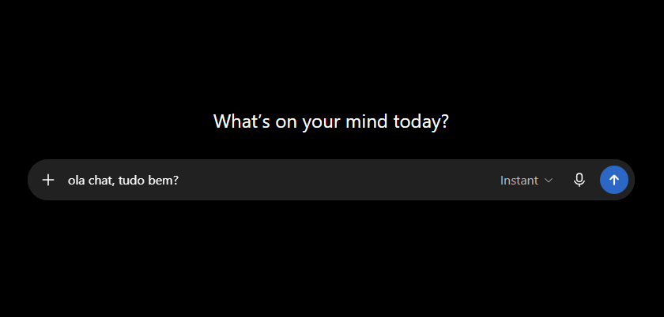 | O print demonstra que o campo de entrada concentra a principal ação da interface e permite entrada textual livre |
| Resposta em formato conversacional | A resposta é apresentada na sequência da mensagem enviada pelo usuário | 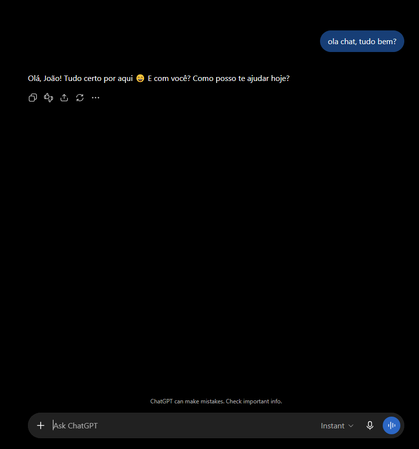 | O print demonstra a organização visual de pergunta e resposta em formato de diálogo; não permite concluir, isoladamente, sobre a compreensão de regras, prazos ou procedimentos |
| Continuidade visual da conversa | O usuário pode enviar uma nova mensagem dentro do mesmo diálogo | 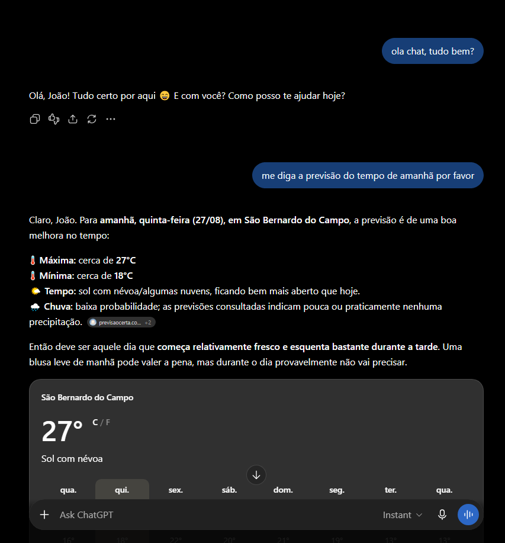 | O print demonstra a permanência de múltiplas mensagens na mesma conversa. Nesta captura específica, a nova pergunta não depende do conteúdo da resposta anterior, portanto não comprova refinamento contextual |
| Apresentação de fontes em respostas com pesquisa na web | Quando a pesquisa na web é utilizada, a resposta pode apresentar referências e permitir acesso à origem da informação | 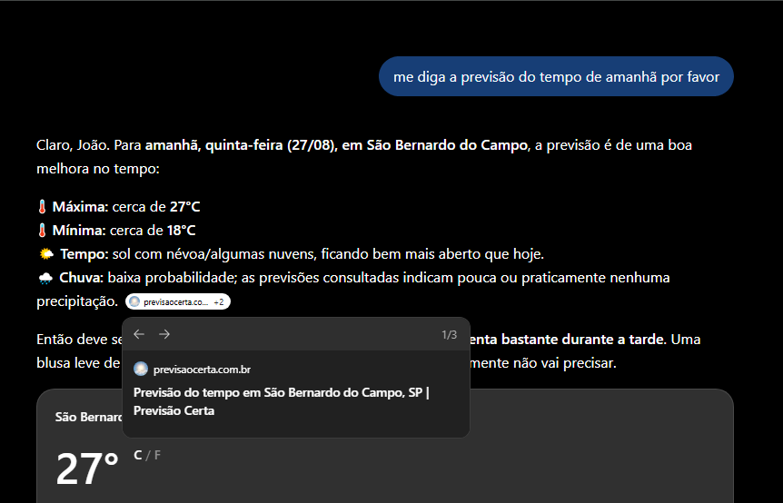 | O print demonstra acesso à origem de uma informação em uma resposta sobre previsão do tempo. O padrão de associação entre resposta e fonte é relevante ao projeto, mas não comprova qualidade ou adequação de uma orientação institucional |
| Histórico de conversas | Conversas anteriores aparecem disponíveis na navegação da interface | 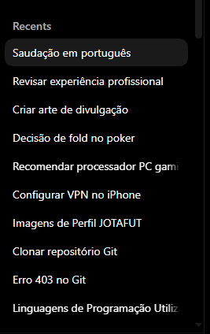 | O print demonstra a existência do padrão de histórico, mas não demonstra que esse recurso seja necessário para estudantes da FEI |

#### Experiência do usuário e opiniões

Estudos com estudantes universitários indicam que facilidade de uso e rapidez das respostas podem ser aspectos positivamente percebidos no uso de ferramentas generativas como o ChatGPT.

Um estudo publicado em 2025 identificou avaliações positivas relacionadas a facilidade de uso, rapidez das respostas, disponibilidade e experiência de interação. Uma pesquisa multi-institucional publicada em 2026 também identificou valorização do acesso rápido à informação, ao mesmo tempo em que registrou preocupações relacionadas a respostas incorretas, dependência excessiva da ferramenta e limitações das versões gratuitas.

Esses resultados pertencem aos contextos investigados pelos respectivos estudos e não demonstram diretamente como estudantes da FEI utilizariam ou avaliariam o assistente proposto.

Para o projeto, as evidências servem como referência para investigar uma interação conversacional simples, sem assumir antecipadamente que ela será percebida como mais fácil ou eficiente pelo nosso público.

#### Preço/modelo de negócio

O ChatGPT utiliza um modelo de acesso que inclui modalidade gratuita e modalidades pagas com diferentes limites e funcionalidades.

Para esta análise de IHC, o aspecto relevante não é o preço de cada modalidade, mas reconhecer que funcionalidades observadas em produtos análogos podem variar conforme a forma de acesso do usuário e, portanto, não devem ser tratadas automaticamente como características universais da experiência.

#### Padrões e tendências percebidos

Os principais padrões observados são:

- campo de texto como elemento central para iniciar a interação;
- uso de linguagem natural como principal forma de entrada;
- organização visual da interação em formato de conversa;
- possibilidade de enviar novas mensagens dentro da mesma conversa;
- apresentação progressiva de mensagens em sequência;
- possibilidade de consultar fontes em determinados tipos de resposta;
- histórico para acesso a conversas anteriores;
- possibilidade de diferentes formas de entrada.

Esses padrões constituem referências de design, mas sua presença no ChatGPT não significa que todos sejam necessários ou adequados ao assistente da FEI.

#### Pontos positivos, limitações e lições

| Ponto | Evidência | Implicação para nosso projeto |
|---|---|---|
| A interação principal pode ser iniciada diretamente por uma entrada em linguagem natural | Interface e print do campo de entrada | Sustenta RC01 como referência para manter evidente a ação principal de formular uma dúvida |
| Perguntas e respostas são apresentadas dentro de uma mesma estrutura conversacional | Prints de resposta e continuidade | Sustenta o uso de uma sequência conversacional. A possibilidade de refinamento contextual é coerente com T04 e com o escopo do TCC, mas não é demonstrada pela captura utilizada nesta entrega |
| Respostas provenientes de pesquisa podem apresentar acesso às fontes | Print de fontes e documentação do produto | O padrão de relacionar conteúdo a uma origem é relevante para T03; no assistente da FEI, a origem deverá estar associada às fontes institucionais utilizadas |
| Estudos relatam facilidade e rapidez como aspectos percebidos positivamente em determinados contextos | Estudos sobre utilização de IA generativa no ensino superior | Esses benefícios podem orientar hipóteses de design, mas não devem ser apresentados como resultados já demonstrados para estudantes da FEI |
| Estudos também relatam preocupação com imprecisões | Estudos sobre utilização de IA generativa | Reforça a necessidade de avaliar compreensão, confiança e reconhecimento dos limites das respostas |
| O histórico permite acessar conversas anteriores | Print do histórico | Demonstra que o padrão existe em um produto análogo, mas não valida H15 nem transforma recuperação entre sessões em requisito do projeto |

---

### Análise C02 — Google Gemini

**Autor(a):** Matheus Dourado Valle — 22.224.023-6  
**Tipo:** análogo  
**Link oficial:** [Gemini — Google](https://gemini.google.com/)  
**Data de acesso:** 04/09/2026

#### Contexto e proposta

O Google Gemini é um assistente de Inteligência Artificial de propósito geral que permite ao usuário formular perguntas e solicitações em linguagem natural e receber respostas em formato conversacional.

Embora não tenha sido desenvolvido especificamente para responder dúvidas acadêmicas e administrativas da FEI, o Gemini é relevante como produto análogo por apresentar um modelo de interação semelhante ao previsto no TCC: entrada em linguagem natural, resposta textual e possibilidade de continuar a conversa por meio de novas mensagens.

A interface também permite acessar conversas anteriores e, em determinadas respostas, consultar referências e conteúdos relacionados. Esses elementos tornam o Gemini uma referência para observar padrões de interação conversacional, apresentação da origem das informações e organização do histórico.

#### Funcionalidades relevantes

| Funcionalidade | Como é realizada | Evidência/print | Observação de IHC |
|---|---|---|---|
| Formulação de perguntas em linguagem natural | O usuário digita sua pergunta ou solicitação em um campo de texto | 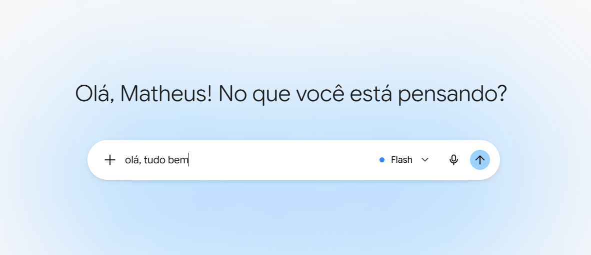 | O print demonstra um campo de entrada textual como ação principal da interface |
| Resposta em formato conversacional | O Gemini apresenta uma resposta textual após a mensagem enviada pelo usuário | 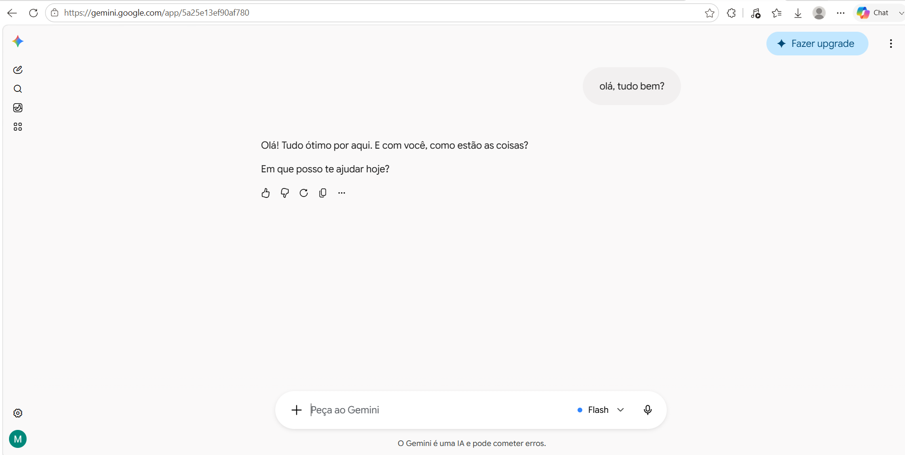 | O print demonstra a organização visual de uma resposta em sequência à mensagem do usuário, mas não demonstra compreensão de regras, etapas ou prazos acadêmicos |
| Continuidade visual da conversa | Uma nova pergunta pode ser enviada dentro da mesma conversa | 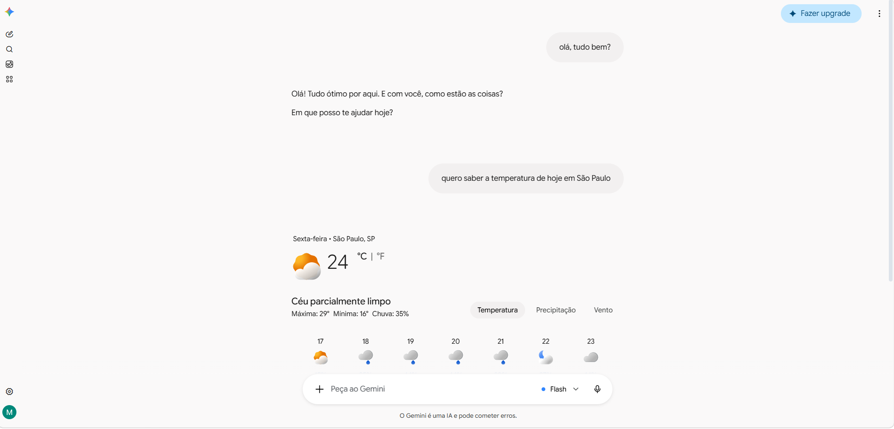 | A captura demonstra uma nova mensagem após a anterior na mesma conversa. Como a segunda pergunta não depende do conteúdo da primeira resposta, o print não comprova preservação contextual nem refinamento da dúvida |
| Apresentação de fontes e conteúdos relacionados | Em determinadas respostas, o Gemini apresenta referências e links relacionados ao conteúdo apresentado | 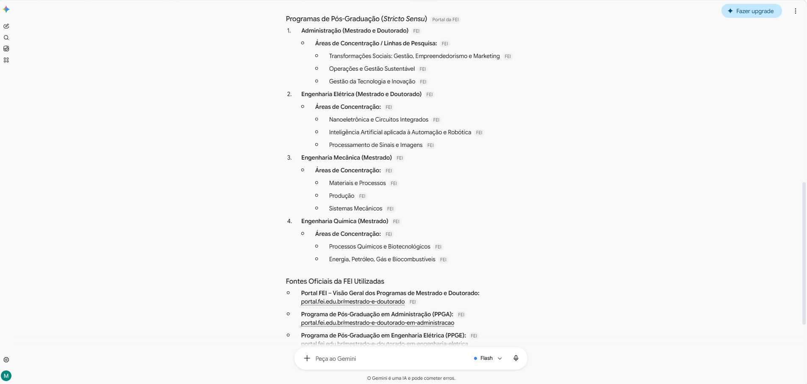 | A captura demonstra referências associadas a uma resposta sobre pós-graduação da FEI e uma área de fontes institucionais. A pergunta inicial não aparece no recorte e não foi verificada nesta análise a correspondência integral de cada afirmação com suas fontes |
| Histórico de conversas | Conversas anteriores podem ser visualizadas e pesquisadas | 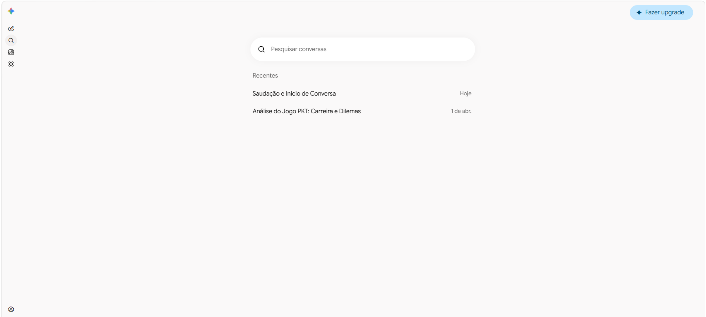 | Demonstra a existência de histórico e pesquisa de conversas, mas não demonstra que estudantes da FEI necessitem desse recurso |

#### Experiência do usuário e opiniões

A análise foi realizada a partir de um teste exploratório da interface e da documentação oficial do Gemini.

A interface apresenta um campo de entrada de texto de forma destacada e mantém as mensagens organizadas em sequência dentro da conversa.

Também foi observada a possibilidade de apresentação de fontes e conteúdos relacionados em determinadas respostas. A captura sobre pós-graduação da FEI aproxima a análise do domínio do projeto ao mostrar referências institucionais junto ao conteúdo apresentado. Entretanto, esta análise não verificou individualmente se todas as informações da resposta eram integralmente sustentadas pelas fontes exibidas.

Outro aspecto observado é o aviso apresentado pela própria interface de que respostas produzidas por IA podem conter erros. A existência desse aviso é uma característica visível da interface. Sua eficácia para ajudar um estudante a avaliar uma resposta ou decidir como prosseguir não foi investigada.

Assim, a análise permite identificar padrões de interface e riscos relevantes ao projeto, mas não comprova que esses mecanismos sejam suficientes para garantir compreensão, confiança adequada ou uso correto das informações.

#### Preço/modelo de negócio

O Google Gemini combina acesso sem plano específico de IA com modalidades pagas do Google AI que podem oferecer diferentes limites e funcionalidades.

Para esta análise de IHC, o ponto relevante é reconhecer que funcionalidades e limites de uso podem variar conforme a modalidade de acesso e que essas diferenças não devem ser confundidas com características necessárias ao assistente da FEI.

#### Padrões e tendências percebidos

Os principais padrões observados são:

- campo de texto como principal ponto de entrada;
- uso de linguagem natural;
- respostas organizadas em formato conversacional;
- possibilidade de enviar novas mensagens na mesma conversa;
- acesso e pesquisa de conversas anteriores;
- apresentação de fontes ou conteúdos relacionados em determinadas respostas;
- aviso geral de que respostas produzidas por IA podem conter erros.

Esses padrões constituem referências para o projeto. A análise não confirma que os estudantes da FEI estejam familiarizados com todos eles nem que devam ser automaticamente incorporados à interface.

#### Pontos positivos, limitações e lições

| Ponto | Evidência | Implicação para nosso projeto |
|---|---|---|
| Permite iniciar uma consulta diretamente em linguagem natural | Interface e print da pergunta | Sustenta RC01 como referência para destacar a formulação da dúvida como ação principal |
| Mantém múltiplas mensagens organizadas em uma mesma conversa | Print de continuidade | Sustenta o formato conversacional, mas a captura utilizada não comprova refinamento contextual; essa capacidade no projeto está relacionada a T04 e ao escopo definido no TCC |
| Pode apresentar fontes e conteúdos relacionados às respostas | Print das fontes e documentação oficial | Sustenta RC03 como padrão para relacionar informações à sua origem; no projeto, as fontes devem ser institucionais e compreensíveis ao estudante |
| Mantém acesso e pesquisa de conversas anteriores | Print do histórico | Demonstra a existência do padrão, mas não valida a necessidade representada por H15 |
| Nem todas as respostas necessariamente apresentam fontes | Documentação e teste exploratório | No projeto, a apresentação da origem institucional deverá ser tratada de maneira coerente com a fundamentação documental prevista no TCC |
| A interface apresenta aviso de que a IA pode cometer erros | Interface | O aviso demonstra comunicação geral de risco, mas não mostra ao usuário por que uma resposta específica ficou sem evidência nem como prosseguir; T05 exige uma comunicação mais contextualizada |
| É um assistente de propósito geral | Escopo do produto | O assistente da FEI possui escopo mais restrito, associado a informações acadêmico-administrativas e fontes institucionais selecionadas |

---

## 3. Softwares que o público-alvo usa no cotidiano

Como ainda não foi realizado um levantamento direto sobre quais ferramentas são mais utilizadas pelos estudantes da FEI, foram selecionadas interfaces presentes no contexto acadêmico ou plausivelmente familiares ao público-alvo.

A análise desta seção busca observar características visíveis de organização e terminologia. A presença dessas interfaces no contexto acadêmico não comprova, por si só, familiaridade de todos os estudantes nem permite concluir que seus fluxos sejam fáceis ou difíceis sem uma análise mais específica do percurso realizado.

| Software | Relação com o contexto acadêmico | Padrões observáveis no print | Prints | O que aprender |
|---|---|---|---|---|
| Portal do Aluno / sistemas acadêmicos da FEI | Reúne serviços e informações relacionados à vida acadêmica | Presença de menus, atalhos, categorias e nomenclaturas de serviços acadêmicos | 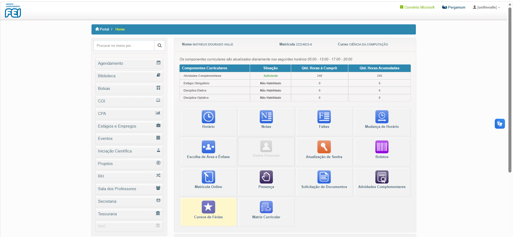 | Observar o vocabulário institucional utilizado para nomear serviços e informações. A captura isolada não permite concluir quantas etapas uma consulta específica exige |
| Moodle | Plataforma utilizada no contexto acadêmico para acesso a conteúdos e atividades | Painel organizado por cursos, mecanismos de busca e controles de organização | 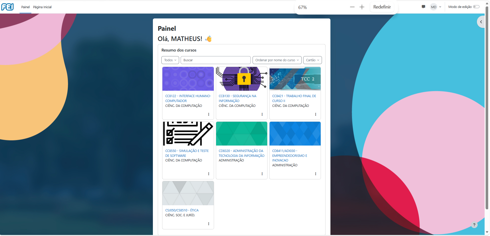 | Observar padrões de agrupamento e nomenclatura. O print do painel não demonstra o percurso completo para localizar um aviso, atividade ou prazo |
| ChatGPT | Produto análogo de interação conversacional | Campo de entrada textual, organização sequencial de mensagens e histórico |  | Observar como uma ação principal pode permanecer destacada em uma interface conversacional, sem assumir que o padrão seja familiar a todos os estudantes |

---

## 3.1 Padrões de interface relevantes ao escopo de IHC

| Padrão observado | Produto(s) | Para qual tarefa serve | Característica ou vantagem potencial | Risco/limitação | Aplicável ao nosso escopo? |
|---|---|---|---|---|---|
| Campo de entrada em linguagem natural | ChatGPT e Gemini | T01 — formular uma dúvida | Mantém a entrada textual como ação central da interface | Perguntas vagas ou ambíguas podem exigir esclarecimento | Sim |
| Organização em formato conversacional | ChatGPT e Gemini | T02 e T04 — acompanhar a resposta e continuar a conversa | Mantém perguntas e respostas em uma sequência visível | Os prints analisados demonstram novas mensagens na mesma conversa, mas não comprovam refinamento contextual | Sim |
| Apresentação de fontes associadas à resposta | ChatGPT e Gemini | T03 — identificar e consultar a origem da informação | Fornece ao usuário um caminho para acessar a origem apresentada pelo sistema | A presença de uma fonte não garante que ela seja adequada ou suficiente para sustentar toda a resposta | Sim |
| Histórico de conversas entre sessões | ChatGPT e Gemini | T06 — possível retomada de consultas anteriores | Permite acessar conversas registradas anteriormente | Sua necessidade para estudantes da FEI permanece como H15; pode também envolver decisões futuras de armazenamento e privacidade | Talvez |
| Navegação por menus e categorias | Portal do Aluno e Moodle | Localizar serviços ou conteúdos em estruturas organizadas | Expõe categorias e nomenclaturas do domínio | Os prints apresentados não permitem medir quantidade de etapas nem dificuldade de navegação | Talvez |
| Organização contextual de conteúdos | Moodle | Relacionar informações a cursos ou contextos acadêmicos | Apresenta informações agrupadas dentro de uma estrutura acadêmica | A captura analisada não mostra o percurso interno de localização de uma informação específica | Talvez |
| Indicação de estado/processamento | Referência conceitual para o projeto | Informar que uma solicitação foi recebida e está sendo processada | Pode reduzir incerteza durante uma espera | O conjunto de prints desta entrega não contém evidência específica suficiente para analisar esse estado nos concorrentes | Sim, como decisão a ser refinada |
| Vocabulário do domínio acadêmico | Portal do Aluno e Moodle | Ajudar no reconhecimento de serviços e informações | Permite aproveitar nomenclaturas institucionais já existentes | A familiaridade real dos estudantes com cada termo ainda deverá ser investigada | Sim |

---

## 4. Síntese comparativa da equipe

| Critério | Concorrente C01 — Entrega 02: ChatGPT | Concorrente C02 — Entrega 02: Google Gemini | Oportunidade para o projeto |
|---|---|---|---|
| Entrada principal | Campo textual destacado para envio de mensagens | Campo textual destacado para envio de mensagens | Manter a formulação da dúvida em linguagem natural como ação principal da interface, relacionada a T01 |
| Organização da conversa | Perguntas e respostas são apresentadas em sequência dentro do diálogo | Perguntas e respostas são apresentadas em sequência dentro do diálogo | Utilizar uma estrutura conversacional que permita acompanhar a consulta e suporte a continuidade prevista em T04 |
| Continuidade | O print demonstra o envio de uma nova mensagem na mesma conversa, mas não comprova dependência contextual entre as perguntas | O print também demonstra uma nova mensagem no mesmo diálogo sem comprovar refinamento contextual | A continuidade contextual faz parte do escopo do nosso TCC; sua implementação não deve ser apresentada como conclusão obtida exclusivamente pelos prints dos concorrentes |
| Fontes | Em determinadas respostas, apresenta citações e acesso à origem da informação | Em determinadas respostas, apresenta referências e links; a captura sobre pós-graduação da FEI mostra fontes institucionais associadas ao conteúdo | Relacionar claramente resposta e fonte institucional para apoiar T03, investigando posteriormente se o estudante compreende essa relação |
| Comunicação de risco | Estudos e documentação alertam para possibilidade de imprecisões | A interface apresenta aviso geral de que a IA pode cometer erros | O projeto deve ir além de um aviso geral e tratar contextualizadamente a ausência de evidência conforme T05 |
| Histórico entre sessões | A interface apresenta conversas anteriores | A interface apresenta conversas anteriores e mecanismo de pesquisa | Manter H15 aberta. A existência do padrão nos concorrentes não comprova necessidade para estudantes da FEI |
| Terminologia | A interação não exige exposição dos componentes técnicos internos do sistema | A interação também ocorre sem exigir conhecimento técnico sobre modelos | Utilizar linguagem acadêmico-administrativa compreensível e evitar exposição desnecessária de termos como RAG, embeddings, chunks ou banco vetorial |
| Acessibilidade | Não foi realizada avaliação específica nesta análise | Não foi realizada avaliação específica nesta análise | Considerar acessibilidade nas etapas próprias de projeto e avaliação, sem inferir sua qualidade a partir desta análise |
| Processamento/espera | Não há captura específica de estado de processamento no conjunto analisado | Não há captura específica de estado de processamento no conjunto analisado | O TCC prevê tempo de resposta e serviços externos; portanto, feedback de processamento permanece como necessidade de design a ser definida, não como conclusão comprovada por estes prints |

---

## 5. Recomendações derivadas

As recomendações abaixo distinguem o **elemento observado nas interfaces**, sua **interpretação para o projeto** e a **tarefa do estudante que poderá ser apoiada**.

- **RC01 — Manter a formulação da dúvida como ação principal da interface.**  
  **Observado:** C01 e C02 apresentam campo textual destacado para iniciar a interação.  
  **Adaptação ao projeto:** permitir que o estudante formule uma dúvida acadêmica ou administrativa em linguagem natural, sem exigir configuração prévia da consulta.  
  **Relacionada a:** **T01**.

- **RC02 — Estruturar a interação para permitir continuidade e complementação dentro da mesma conversa.**  
  **Observado:** C01 e C02 apresentam múltiplas mensagens organizadas dentro de um mesmo diálogo. Os prints utilizados nesta entrega não demonstram uma pergunta complementar que dependa da resposta anterior.  
  **Adaptação ao projeto:** a continuidade contextual será mantida porque já faz parte do escopo do TCC e de **T04**, permitindo perguntas complementares dentro da sessão. A eficácia desse comportamento deverá ser avaliada posteriormente.  
  **Relacionada a:** **T04**.

- **RC03 — Relacionar claramente as informações apresentadas às respectivas fontes institucionais.**  
  **Observado:** C01 e C02 apresentam mecanismos para acessar referências associadas às respostas; no Gemini, a captura sobre pós-graduação da FEI mostra fontes institucionais junto ao conteúdo.  
  **Adaptação ao projeto:** a interface deverá permitir que o estudante reconheça qual fonte institucional está relacionada à informação apresentada, indo além da simples disponibilização de um link.  
  **Relacionada a:** **T03** e às hipóteses **H02/H14**.

- **RC04 — Comunicar contextualizadamente quando não houver evidência institucional suficiente.**  
  **Observado:** os concorrentes e a literatura analisada evidenciam o risco de respostas produzidas por IA conterem erros; no Gemini há um aviso geral explícito sobre essa possibilidade. Os prints não demonstram um mecanismo específico de recusa por ausência de evidência.  
  **Adaptação ao projeto:** esta recomendação deriva principalmente da restrição já definida no TCC e na Entrega 1: quando a base não fornecer evidência suficiente, o assistente deverá reconhecer a limitação e orientar o estudante sobre como prosseguir.  
  **Relacionada a:** **T05** e **H16**.

- **RC05 — Utilizar vocabulário próximo ao contexto acadêmico-administrativo do estudante e evitar jargão técnico do sistema.**  
  **Observado:** C01 e C02 permitem interação em linguagem natural; Portal do Aluno e Moodle apresentam nomenclaturas relacionadas ao contexto acadêmico.  
  **Adaptação ao projeto:** priorizar termos relacionados às atividades do estudante e evitar exposição desnecessária de conceitos internos como RAG, embeddings, chunks e recuperação vetorial. A familiaridade dos estudantes com termos específicos continuará sendo investigada.  
  **Relacionada a:** **T01**, **T02** e **H18**.

- **RC06 — Fornecer feedback de que a pergunta foi recebida e está sendo processada quando houver espera perceptível.**  
  **Observado:** o conjunto de prints desta entrega não fornece evidência específica suficiente sobre estados de processamento de C01 e C02.  
  **Adaptação ao projeto:** a recomendação decorre da arquitetura prevista no TCC, que utiliza serviços externos e registra tempo de resposta. A necessidade e a forma de um indicador de processamento mais elaborado dependerão do tempo percebido durante o uso.  
  **Relacionada a:** fluxo entre **T01** e **T02**.

- **RC07 — Manter a recuperação de conversas entre sessões como possibilidade a investigar, e não como requisito confirmado.**  
  **Observado:** C01 e C02 possuem histórico de conversas; no Gemini também foi observado mecanismo de pesquisa.  
  **Adaptação ao projeto:** a existência do padrão demonstra uma alternativa de interface, mas não valida sua necessidade para estudantes da FEI. A continuidade dentro da sessão já faz parte do TCC; a recuperação entre sessões permanece como hipótese.  
  **Relacionada a:** **T06** e **H15**.

- **RC08 — Manter acesso evidente à ação principal de consulta, sem transformar menus ou categorias em pré-requisito para formular uma dúvida.**  
  **Observado:** C01 e C02 destacam o campo de entrada como ação central. Portal do Aluno e Moodle mostram estruturas organizadas por menus, categorias ou contexto, mas os prints apresentados não permitem concluir que essas estruturas exigem navegação excessiva.  
  **Adaptação ao projeto:** utilizar a conversa como ponto principal de entrada, podendo recorrer a outros elementos de organização apenas quando houver uma necessidade identificada. A recomendação não pressupõe que Portal ou Moodle sejam menos eficientes.  
  **Relacionada a:** **T01**.

---

## Referências

### Concorrente C01 — ChatGPT

- OPENAI. **ChatGPT**. Página oficial do produto. Disponível em: https://chatgpt.com/. Acesso em: 26 ago. 2026.

- OPENAI. **Como pesquisar na web com o ChatGPT**. OpenAI Help Center. Acesso em: 26 ago. 2026. Utilizado como referência para a análise da apresentação de citações e fontes em respostas que utilizam pesquisa na web.

- OPENAI. **Visão geral dos recursos do ChatGPT**. OpenAI Help Center. Acesso em: 26 ago. 2026. Utilizado como referência para funcionalidades observadas além dos prints apresentados nesta entrega.

- OPENAI. **O que é o ChatGPT?** OpenAI Help Center. Acesso em: 26 ago. 2026. Utilizado como referência para a descrição geral do produto.

### Estudos sobre experiência e percepção de estudantes em relação ao ChatGPT

- ALSHAMY, Alsaeed; AL-HARTHI, Aisha Salim Ali; ABDULLAH, Shubair. **Perceptions of Generative AI Tools in Higher Education: Insights from Students and Academics at Sultan Qaboos University**. *Education Sciences*, v. 15, n. 4, p. 501, 2025. DOI: https://doi.org/10.3390/educsci15040501.

- CONDE, Miguel Á.; GARCÍA-PASCUAL, Rocío; RODRÍGUEZ-SEDANO, Francisco J.; ROMÁN-GALLEGO, Jesús-Ángel. **Expanding the lens: multi-institutional evidence on student use of ChatGPT in higher education**. *Universal Access in the Information Society*, v. 25, art. 48, 2026. DOI: https://doi.org/10.1007/s10209-026-01315-w.

### Concorrente C02 — Google Gemini

- GOOGLE. **Gemini**. Página oficial do produto. Disponível em: https://gemini.google.com/. Acesso em: 4 set. 2026.

- GOOGLE. **Ver fontes relacionadas dos apps do Gemini**. Ajuda do Apps do Gemini. Acesso em: 4 set. 2026. Utilizado como referência para a análise da apresentação de fontes e links relacionados.

- GOOGLE. **Encontrar e gerenciar suas conversas recentes nos apps do Gemini**. Ajuda do Apps do Gemini. Acesso em: 4 set. 2026. Utilizado como referência para histórico, pesquisa e retomada de conversas.

- GOOGLE. **Limites e upgrades dos apps do Gemini para assinantes dos planos com IA do Google**. Ajuda do Apps do Gemini. Acesso em: 4 set. 2026. Utilizado como referência para diferenças de disponibilidade de funcionalidades.

### Interfaces utilizadas no contexto acadêmico

- CENTRO UNIVERSITÁRIO FEI. **Mapa do Site**. Acesso em: 2 set. 2026. Utilizado para identificar serviços digitais disponibilizados aos estudantes.

- CENTRO UNIVERSITÁRIO FEI. **Padronização do Ambiente Virtual de Aprendizagem**. 27 mar. 2020. Acesso em: 2 set. 2026. Utilizado como evidência do uso do Moodle no contexto institucional.

- CENTRO UNIVERSITÁRIO FEI. **Secretaria FEI: Campus São Paulo e São Bernardo do Campo**. Acesso em: 2 set. 2026. Utilizado como exemplo de disponibilização de informações e procedimentos acadêmico-administrativos.

- MOODLE. **Moodle LMS**. Página oficial da plataforma. Acesso em: 2 set. 2026.

- MOODLE. **Recursos do Moodle LMS**. Acesso em: 2 set. 2026. Utilizado como referência para características gerais da plataforma.

> Para atender integralmente à rastreabilidade das fontes, os endereços eletrônicos específicos das páginas de ajuda e páginas institucionais efetivamente consultadas devem permanecer registrados junto a cada referência.

### Documentos internos do projeto

- VALLE, Matheus Dourado; GARCIA, João Pedro Sabino. **Assistente Virtual com Inteligência Artificial para Suporte a Dúvidas Acadêmicas e Administrativas na FEI**. Trabalho de Conclusão de Curso, Centro Universitário FEI.

- EQUIPE IHC. **Entrega 1 — Conhecendo o projeto, o usuário e o problema**. Documento interno do projeto `Ihc2026`. Utilizado como base para definição do público-alvo, atividades, hipóteses e restrições retomadas nesta entrega.

---

## Checklist

- [x] O mapa inicial de alternativas da Entrega 1 foi revisitado e aprofundado.
- [x] O destino das alternativas não aprofundadas nesta entrega foi explicitado.
- [x] Hipóteses existentes foram preservadas quando a análise dos concorrentes não forneceu evidência suficiente para confirmá-las ou refutá-las.
- [x] Há pelo menos uma análise completa por integrante.
- [x] Cada análise contém prints legíveis da interface.
- [x] Prints mostram telas/estados relevantes, não apenas logos/homepage.
- [x] As conclusões foram limitadas ao que os prints, documentação ou estudos efetivamente sustentam.
- [x] Foram analisados concorrentes e/ou interfaces representativas ao público.
- [x] Padrões observados foram diferenciados de benefícios ainda hipotéticos para estudantes da FEI.
- [x] Recomendações RC01–RC08 foram relacionadas às tarefas e hipóteses relevantes.
- [x] Opiniões e afirmações externas de UX possuem fonte.
- [x] A síntese compara critérios comuns e produz recomendações para o projeto.
- [x] Não há “copiar porque o concorrente faz”; há justificativa de adequação ao público e ao contexto.

## Histórico de revisões

### 03/10/2026 — Revisão após feedback da Entrega 1

- uniformização da distinção entre fatos `[F]`, hipóteses `[H]` e lacunas `[?]`;
- revisão das atividades A01 e A02 para não apresentar frequência ou criticidade como fatos ainda não investigados;
- reformulação da situação concreta da seção 4.5 como situação hipotética explicitamente identificada;
- melhoria da identificação das evidências e ligação com [`../BIBLIOGRAFIA.md`](../BIBLIOGRAFIA.md);
- distinção entre continuidade da conversa durante a sessão atual e recuperação de conversas entre sessões diferentes;
- correção dos encaminhamentos das hipóteses para as entregas adequadas da disciplina;
- revisão do escopo de IHC, tarefas T04 e T06 e síntese final para refletir essas decisões.
