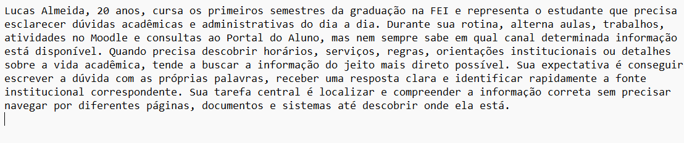
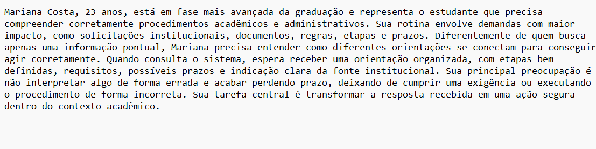
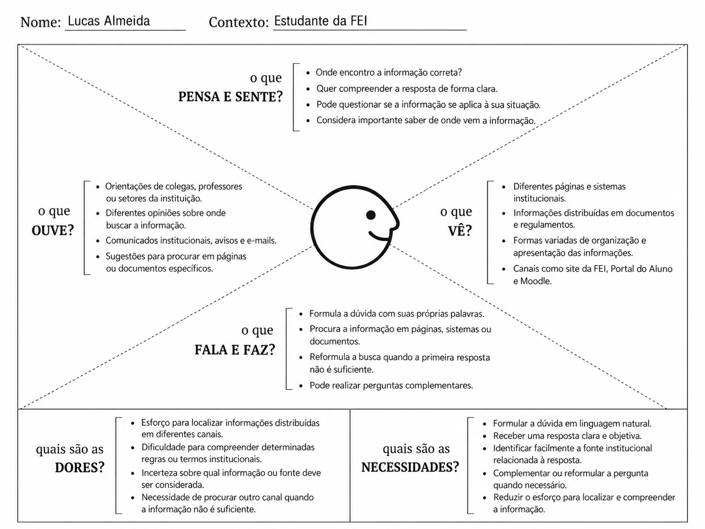

# Entrega 3 - Personas, mapa de empatia, contexto de uso e jornada

**Data:** 01/09/2026  
**Status:** 🟨 em andamento
**Responsabilidade:** 1 persona por integrante; 1 mapa de empatia, 1 contexto de uso consolidado e 1 jornada por equipe (salvo orientação diferente do docente).

## Objetivo da atividade

Representar grupos de usuários de forma útil para decisões de design. Persona não é personagem decorativo: suas características devem alterar requisitos, prioridades, linguagem, fluxos ou critérios de avaliação.

## Atenção a projetos técnicos

Em TCCs sem interface original, a persona pode representar um **profissional que se apropria da contribuição técnica**: DBA, analista, cientista de dados, administrador, pesquisador, técnico, operador, gestor ou especialista de domínio.

Não escolha um perfil apenas porque “parece combinar” com a tecnologia. Explique **qual objetivo esse perfil teria e qual parte da contribuição do TCC produziria valor para ele**. Se ainda for hipótese, mantenha como hipótese/proto-persona a validar.

Também considere papéis diferentes quando houver tarefas distintas, por exemplo:

- operador que executa análises;
- administrador que configura e gerencia permissões;
- especialista que interpreta resultados;
- gestor que consulta relatórios e decide;
- auditor que revisa histórico.

## Entradas da Entrega 1

Antes de criar personas, retome os tipos de usuários, características relevantes, objetivos e hipóteses registradas na Entrega 1. A persona **não deve transformar uma hipótese inicial em fato por meio de uma história fictícia**.

| Item da Entrega 1 | Status inicial | Evidência disponível agora | Como será tratado nesta entrega |
|---|---|---|---|
| Estudante da FEI como usuário direto prioritário | F | O TCC e a Entrega 1 definem o estudante da FEI como principal usuário da interface de consulta acadêmico-administrativa | Incorporar como base das personas primárias |
| A01 - Localizar e compreender uma informação acadêmica ou administrativa | F | Atividade priorizada na Entrega 1 a partir do escopo definido para a interface do TCC | Incorporar como objetivo de uma das personas |
| A02 - Entender como realizar um procedimento acadêmico ou administrativo e quais etapas, regras ou prazos devem ser observados | F | Atividade priorizada na Entrega 1 a partir do escopo definido para a interface do TCC | Incorporar como objetivo de uma das personas |
| Estudantes podem enfrentar dificuldade ou esforço excessivo para localizar informações distribuídas entre páginas, documentos e canais institucionais | H | A situação é apresentada como motivação do TCC, mas ainda não foi validada diretamente com estudantes da FEI | Manter como hipótese e utilizar apenas como ponto a investigar nas personas |
| Estudantes podem possuir diferentes níveis de familiaridade com regras, procedimentos e terminologia institucional | H | Ainda não foi realizado levantamento direto com estudantes sobre conhecimento do domínio | Manter como hipótese e considerar diferenças de familiaridade entre as personas |
| Algumas consultas relacionadas a regras, prazos e procedimentos podem possuir maior criticidade ou urgência | H | A Entrega 1 identificou essa possibilidade, mas ainda não há dados sobre frequência ou gravidade percebida pelos estudantes | Manter como hipótese e considerar principalmente na persona associada à A02 |
| O histórico de conversas pode ajudar o estudante a retomar consultas anteriores | H | O recurso foi observado em ChatGPT e Gemini na Entrega 2, mas sua necessidade para estudantes da FEI ainda não foi validada | Não tratar como necessidade da persona; manter como possibilidade de design |
| Dispositivo predominante utilizado para realizar consultas acadêmicas e administrativas | ? | Ainda não há levantamento sobre preferência entre computador, notebook ou celular | Manter em aberto e evitar definir um dispositivo principal como característica da persona |
| Necessidades específicas de acessibilidade do público-alvo | ? | Ainda não foi realizado levantamento com usuários sobre necessidades de acessibilidade | Manter em aberto e não inventar restrições individuais para as personas |

### Persona P01 - Lucas Almeida

**Autor(a):** Matheus Dourado Valle - 22.224.023-6  
**Tipo:** primária  
**Base de evidências:** proto-persona a validar, construída a partir do escopo do TCC, da Entrega 1 e dos padrões observados na análise de concorrência  
**Hipóteses da Entrega 1 relacionadas:** H04, H08, H09, H14 e H18

| Campo | Descrição |
|---|---|
| Faixa etária / contexto relevante | 20 anos, estudante de graduação em fase inicial/intermediária do curso, com rotina acadêmica ativa e necessidade frequente de consultar informações institucionais. |
| Ocupação/papel | Estudante da FEI e usuário direto do assistente em consultas informacionais. |
| Conhecimento do domínio | [H] Conhece parcialmente a rotina acadêmica, mas nem sempre domina a estrutura dos canais institucionais ou a terminologia usada para localizar certas informações. |
| Experiência tecnológica | [H] Tem familiaridade com ambientes digitais acadêmicos, como Portal do Aluno e Moodle, e tende a lidar bem com interfaces web e ferramentas de busca. |
| Objetivos | Encontrar e compreender informações acadêmicas e administrativas de forma rápida, clara e confiável. |
| Necessidades | Formular dúvidas em linguagem natural; receber respostas objetivas; entender a informação sem precisar interpretar longos documentos; visualizar a fonte institucional da resposta. |
| Dores/frustrações | [H] Perde tempo quando a informação está distribuída em páginas diferentes; pode não saber em qual sistema ou documento procurar; pode encontrar conteúdos pouco claros ou excessivamente institucionais. |
| Motivadores | Resolver dúvidas com autonomia, sem depender de procurar manualmente em vários canais ou de recorrer imediatamente a terceiros. |
| Restrições/acessibilidade | [?] Não há evidências específicas sobre restrições de acessibilidade desse perfil até o momento. |
| Ambiente típico de uso | [H] Consulta informações em casa, no campus ou em intervalos entre atividades acadêmicas, provavelmente alternando entre notebook e celular. |
| Comportamentos relevantes | [H] Tende a começar pela pergunta direta; se não entender a resposta, busca reformular a dúvida ou confirmar a informação em outra fonte. |

**Decisões de design influenciadas por P01:**

- destacar a pergunta em linguagem natural como ação principal da interface;
- evitar exigir que o estudante conheça previamente a estrutura dos documentos ou canais da FEI;
- priorizar respostas curtas, claras e diretamente relacionadas à dúvida formulada;
- apresentar a fonte institucional da resposta de forma visível;
- permitir perguntas complementares para esclarecer a informação;
- informar de forma clara quando não houver evidência suficiente para responder.

### Persona P02 — Mariana Costa

*Autor(a):* João Pedro Sabino Garcia — 22.224.032-7  
*Tipo:* secundária  
*Base de evidências:* proto-persona a validar, construída a partir do escopo do TCC, da Entrega 1 e da análise de concorrência da Entrega 2  
*Hipóteses da Entrega 1 relacionadas:* H04, H09, H10, H14, H16 e H18

Mariana Costa, 23 anos, está em fase mais avançada da graduação e representa o estudante que precisa compreender corretamente procedimentos acadêmicos e administrativos. Sua rotina envolve demandas com maior impacto, como solicitações institucionais, documentos, regras, etapas e prazos. Diferentemente de quem busca apenas uma informação pontual, Mariana precisa entender como diferentes orientações se conectam para conseguir agir corretamente. Quando consulta o sistema, espera receber uma orientação organizada, com etapas bem definidas, requisitos, possíveis prazos e indicação clara da fonte institucional. Sua principal preocupação é não interpretar algo de forma errada e acabar perdendo prazo, deixando de cumprir uma exigência ou executando o procedimento de forma incorreta. Sua tarefa central é transformar a resposta recebida em uma ação segura dentro do contexto acadêmico.

| Campo | Descrição |
|---|---|
| Faixa etária / contexto relevante | 23 anos, estudante de graduação em fase mais avançada do curso, com maior contato com procedimentos acadêmicos e administrativos que exigem atenção a regras e prazos. |
| Ocupação/papel | Estudante da FEI e usuária direta do assistente em consultas procedimentais. |
| Conhecimento do domínio | [H] Conhece a dinâmica acadêmica geral, mas não necessariamente domina detalhes de procedimentos específicos, seus requisitos, documentos ou etapas. |
| Experiência tecnológica | [H] Tem familiaridade com sistemas acadêmicos e plataformas digitais, mas isso não elimina dúvidas quando a tarefa exige interpretar procedimentos institucionais. |
| Objetivos | Entender corretamente como realizar um procedimento acadêmico ou administrativo e quais cuidados devem ser observados. |
| Necessidades | Receber orientações estruturadas; visualizar etapas, regras, requisitos e prazos quando disponíveis; conseguir identificar a fonte institucional; esclarecer dúvidas complementares sem reiniciar toda a busca. |
| Dores/frustrações | [H] Fica insegura quando a orientação está espalhada em diferentes fontes; pode ter dificuldade para relacionar regras e etapas; teme perder prazo ou executar um procedimento de forma incorreta. |
| Motivadores | Agir com segurança, reduzir o risco de erro e entender com clareza o que precisa ser feito em cada situação. |
| Restrições/acessibilidade | [?] Não há evidências específicas sobre restrições de acessibilidade desse perfil até o momento. |
| Ambiente típico de uso | [H] Consulta informações em momentos de necessidade prática, possivelmente conciliando atividades acadêmicas, estágio e outras responsabilidades, o que aumenta a necessidade de objetividade. |
| Comportamentos relevantes | [H] Costuma iniciar pela dúvida geral sobre o procedimento e, em seguida, buscar detalhes mais específicos sobre requisitos, etapas, documentos ou prazos. |

*Decisões de design influenciadas por P02:*

- permitir dúvidas procedimentais em linguagem natural;
- estruturar respostas com separação clara entre etapas, regras, requisitos e prazos, quando disponíveis;
- evitar inferir ou inventar orientações não sustentadas pelas fontes;
- destacar visualmente a fonte institucional associada à resposta;
- permitir perguntas complementares sobre partes específicas do procedimento;
- sinalizar explicitamente quando determinada etapa, regra ou prazo não puder ser confirmado pela base documental.

### Síntese das personas

As personas P01 e P02 representam dois perfis de uso distintos dentro do mesmo contexto acadêmico-administrativo da FEI.

A **P01 — Lucas Almeida** representa o estudante que busca **localizar e compreender uma informação**. Seu foco está em resolver dúvidas mais pontuais do dia a dia, como regras, serviços, horários, orientações ou informações institucionais. Nesse caso, o principal problema está em descobrir onde a informação está e entendê-la de forma clara.

A **P02 — Mariana Costa** representa o estudante que precisa **entender como realizar corretamente um procedimento**. Seu foco não está apenas em encontrar uma informação isolada, mas em interpretar uma orientação mais estruturada, que pode envolver etapas, requisitos, documentos, regras e prazos. Nesse caso, o risco de erro e a necessidade de organização da resposta são maiores.

As duas personas compartilham algumas necessidades, como formular dúvidas em linguagem natural, receber respostas compreensíveis, visualizar a fonte institucional e poder continuar a interação com perguntas complementares. No entanto, elas se diferenciam pelo **tipo de problema que precisam resolver**:

- a **P01** precisa principalmente **encontrar e entender** uma informação;
- a **P02** precisa principalmente **entender e executar corretamente** um procedimento.

Para o escopo inicial do projeto, a equipe considera a **P01 como persona prioritária**, pois ela representa o fluxo mais geral do assistente: o estudante possui uma dúvida e quer localizar e compreender uma informação acadêmica ou administrativa.

A **P02** é mantida como **persona secundária**, pois amplia o escopo da análise ao representar situações em que a resposta precisa ser mais estruturada e precisa, especialmente quando há risco de interpretação incorreta.

Como ambas são **proto-personas**, os elementos marcados como hipótese `[H]` ou questão em aberto `[?]` deverão ser validados futuramente com estudantes reais da FEI.

## 2. Mapa de empatia - equipe

**Persona escolhida:** P01  
**Justificativa:** A P01 foi escolhida por representar o fluxo mais geral do assistente: o estudante possui uma dúvida acadêmica ou administrativa e precisa localizar e compreender uma informação. Esse perfil está diretamente relacionado à atividade A01 definida na Entrega 1 e permite analisar necessidades centrais da interface, como formulação da dúvida, compreensão da resposta, acesso à fonte institucional e tratamento de situações em que a informação não é encontrada.

Documente também em texto: o que vê; ouve; diz/faz; pensa/sente; dores; ganhos. Diferencie **evidência** de **hipótese**.

- **O que vê:** **[F]** existem diferentes canais institucionais para acesso a informações acadêmicas e administrativas, como site da FEI, Portal do Aluno, Moodle e documentos institucionais. **[H]** o estudante pode perceber essas informações como distribuídas entre diferentes páginas, documentos e sistemas, aumentando o esforço para localizar o conteúdo necessário - H08.

- **O que ouve:** **[H]** quando não encontra ou não compreende uma informação, pode recorrer a colegas, professores ou profissionais da instituição para buscar esclarecimentos. Ainda não há evidência sobre quais desses canais são utilizados com maior frequência pelos estudantes.

- **O que diz e faz:** **[H]** formula sua dúvida utilizando suas próprias palavras, procura informações nos canais institucionais disponíveis e pode reformular a consulta ou realizar perguntas complementares quando a primeira resposta não é suficiente - H04 e H18.

- **O que pensa e sente:** **[H]** pode sentir incerteza quando não sabe onde determinada informação está disponível ou quando precisa interpretar regras e orientações institucionais. Também pode considerar importante compreender a origem da informação apresentada para avaliar sua aplicação ao contexto acadêmico - H09 e H14.

- **Dores:** **[H]** esforço para localizar informações distribuídas entre diferentes páginas, documentos ou canais; dificuldade para interpretar determinadas regras ou orientações; incerteza sobre qual fonte deve ser considerada; e necessidade de recorrer a outro canal quando a informação encontrada não é suficiente - H08 e H09.

- **Ganhos esperados:** **[H]** conseguir formular uma dúvida diretamente em linguagem natural, receber uma resposta clara e compreensível, identificar a fonte institucional relacionada, complementar a pergunta quando necessário e reduzir o esforço para localizar e compreender informações acadêmicas ou administrativas - H04, H14 e H18.
- 
## 3. Contexto de uso - consolidação

| Dimensão | Descrição | Implicação de design |
|---|---|---|
| Usuários | {{...}} | {{...}} |
| Tarefas | {{...}} | {{...}} |
| Equipamentos | {{...}} | {{...}} |
| Ambiente físico | {{...}} | {{...}} |
| Ambiente social/organizacional | {{...}} | {{...}} |
| Papéis/permissões/governança | {{...}} | {{...}} |
| Volume de dados/histórico | {{...}} | {{...}} |

## 4. Jornada do usuário - equipe

**Persona:** {{P01}}  
**Objetivo da jornada:** {{...}}  
**Início e fim da jornada:** {{...}}

| Etapa | Situação/ação | Objetivo | Pensamento/emoção | Dor | Oportunidade de design | Evidência |
|---|---|---|---|---|---|---|
| 1 | {{...}} | {{...}} | {{...}} | {{...}} | {{...}} | {{...}} |

> A jornada pode incluir etapas **antes, durante e depois** do uso do produto. Não transforme a jornada em lista de telas.

## Síntese

Quais necessidades e objetivos devem obrigatoriamente aparecer nos cenários e nas tarefas seguintes?

## Checklist

- [ ] Existe pelo menos uma persona por integrante.
- [ ] As personas não são apenas diferenças demográficas superficiais.
- [ ] Está claro o que é dado real e o que é hipótese/proto-persona.
- [ ] A persona não “validou por ficção” uma hipótese da Entrega 1; afirmações continuam marcadas como hipótese quando não há evidência.
- [ ] Objetivos e dores têm consequência para o design.
- [ ] Contexto de uso está coerente com a Entrega 1.
- [ ] Em TCC sem interface original, a persona possui relação explícita com a contribuição técnica.
- [ ] Papéis administrativos, técnicos e decisórios só foram criados quando possuem objetivos/tarefas diferentes.
- [ ] Jornada possui etapas, dores e oportunidades e não é apenas wireflow.
- [ ] IDs das personas foram adicionados à rastreabilidade.
