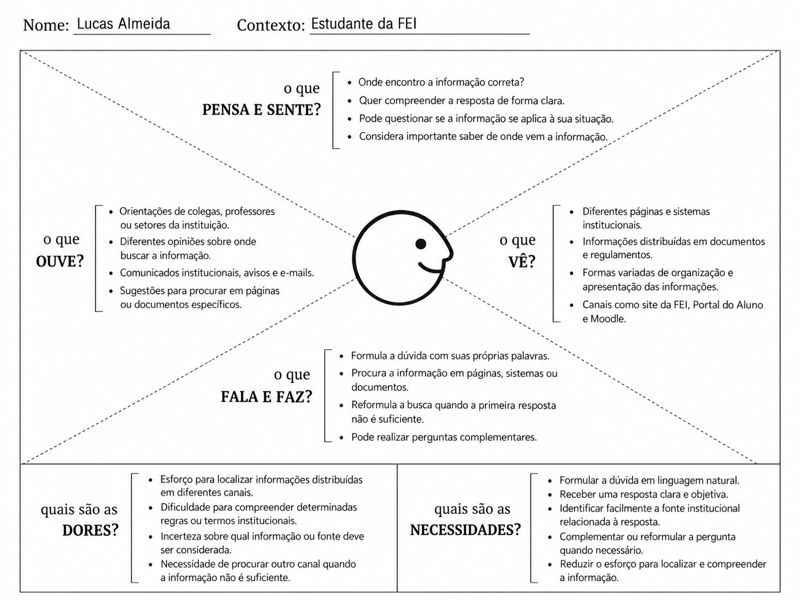

# Entrega 3 - Personas, mapa de empatia, contexto de uso e jornada

**Data inicial:** 01/09/2026  
**Última atualização:** 03/10/2026  
**Status:** 🟦 revisada após feedback 
**Responsabilidade:** 1 persona por integrante; 1 mapa de empatia, 1 contexto de uso consolidado e 1 jornada por equipe (salvo orientação diferente do docente).

## Objetivo da atividade

Representar grupos de usuários de forma útil para decisões de design. Persona não é personagem decorativo: suas características devem alterar requisitos, prioridades, linguagem, fluxos ou critérios de avaliação.

## Atenção a projetos técnicos

Em TCCs sem interface original, a persona pode representar um **profissional que se apropria da contribuição técnica**: DBA, analista, cientista de dados, administrador, pesquisador, técnico, operador, gestor ou especialista de domínio.

Não escolha um perfil apenas porque “parece combinar” com a tecnologia. Explique **qual objetivo esse perfil teria e qual parte da contribuição do TCC produziria valor para ele**. Se ainda for hipótese, mantenha como hipótese/proto-persona a validar.

Também considere papéis diferentes quando houver tarefas distintas, por exemplo:

- operador que executa análises;
- administrador que configura e gerencia permissões;
- especialista que interpreta resultados;
- gestor que consulta relatórios e decide;
- auditor que revisa histórico.

## Entradas da Entrega 1

Antes de criar personas, retome os tipos de usuários, características relevantes, objetivos e hipóteses registrados na Entrega 1. A persona **não deve transformar uma hipótese inicial em fato por meio de uma história fictícia**.

| Item da Entrega 1 | Status inicial | Evidência disponível agora | Como será tratado nesta entrega |
|---|---|---|---|
| Estudante da FEI como usuário direto prioritário | F | O TCC e a Entrega 1 definem o estudante da FEI como principal usuário da interface de consulta acadêmico-administrativa | Incorporar como base das personas primárias |
| A01 - Localizar e compreender uma informação acadêmica ou administrativa | H | A atividade faz parte do recorte definido para o TCC, mas sua frequência entre estudantes ainda precisa ser investigada | Representada principalmente por P01, sem assumir que seja a atividade mais frequente |
| A02 - Entender como realizar um procedimento acadêmico ou administrativo e quais etapas, regras ou prazos devem ser observados | H | Consultas procedimentais fazem parte do escopo do TCC, mas frequência e criticidade percebida ainda precisam ser investigadas | Representada principalmente por P02 |
| Estudantes podem enfrentar dificuldade ou esforço para localizar informações distribuídas entre páginas, documentos e canais institucionais | H | A situação integra a motivação do TCC, mas ainda não foi validada diretamente com estudantes da FEI | Manter como hipótese H08 |
| Estudantes podem possuir diferentes níveis de familiaridade com regras, procedimentos e terminologia institucional | H | Ainda não foi realizado levantamento direto com estudantes sobre conhecimento do domínio | Manter como hipótese e representar diferenças plausíveis entre P01 e P02 |
| Algumas consultas relacionadas a regras, prazos e procedimentos podem possuir maior criticidade | H | A Entrega 1 identificou essa possibilidade, mas ainda não há dados sobre frequência ou gravidade percebida | Manter como hipótese, principalmente em P02 |
| Recuperar conversas de sessões anteriores pode ajudar o estudante a retomar consultas | H | O padrão foi observado nos concorrentes C01 e C02 da Entrega 2, mas sua necessidade para estudantes da FEI ainda não foi validada | Manter H15 aberta; não tratar como necessidade obrigatória das personas |
| Continuidade da conversa durante a sessão atual | F | O TCC prevê histórico e contexto das interações durante a sessão | Considerar como capacidade já prevista no fluxo do assistente |
| Dispositivo predominante utilizado para consultas acadêmicas e administrativas | ? | Ainda não há levantamento sobre preferência entre computador, notebook ou celular | Manter em aberto; situações hipotéticas podem adotar um dispositivo específico sem afirmar predominância |
| Necessidades específicas de acessibilidade do público-alvo | ? | Ainda não foi realizado levantamento específico com usuários | Manter como questão de projeto e não inventar uma condição individual |

---

## 1. Personas

### Persona P01 - Lucas Almeida

**Autor(a):** Matheus Dourado Valle - 22.224.023-6  
**Tipo:** primária  
**Base de evidências:** proto-persona a validar, construída a partir do escopo do TCC, das hipóteses da Entrega 1 e dos padrões analisados na Entrega 2  
**Hipóteses relacionadas:** H04, H08, H09, H14 e H18  
**Atividade principalmente representada:** A01 — localizar e compreender uma informação acadêmica ou administrativa

#### Biografia

Lucas Almeida tem 20 anos e está na fase inicial da graduação na FEI. Por ainda estar construindo familiaridade com os processos e serviços da instituição, representa situações em que o estudante sabe **o que deseja descobrir**, mas pode não saber previamente em qual página, documento, sistema ou setor está a informação correspondente.

Durante sua rotina acadêmica, Lucas acompanha aulas, atividades e informações em diferentes ambientes digitais. Quando surge uma dúvida pontual que interfere na organização de suas atividades, sua prioridade é compreender a informação necessária sem precisar primeiro dominar a estrutura institucional na qual ela está publicada.

Se uma orientação não estiver clara, Lucas pode precisar reformular sua dúvida, consultar a fonte apresentada ou recorrer a outro canal para confirmar o que deve fazer. Essas características são hipóteses utilizadas para orientar o projeto e ainda deverão ser investigadas com estudantes reais.

| Campo | Descrição |
|---|---|
| Faixa etária / contexto relevante | 20 anos, estudante nos primeiros semestres da graduação. A fase inicial é relevante por representar menor tempo de contato com serviços, terminologias e procedimentos institucionais. |
| Ocupação/papel | Estudante da FEI e usuário direto do assistente em consultas predominantemente informacionais. |
| Conhecimento do domínio | **[H]** Conhece parcialmente a rotina acadêmica, mas pode não dominar a estrutura dos canais institucionais nem saber onde determinados conteúdos estão disponíveis. |
| Experiência tecnológica | **[H]** Utiliza ambientes digitais no contexto acadêmico, mas familiaridade tecnológica não implica conhecimento sobre a organização das informações da instituição. |
| Objetivo principal | Localizar e compreender uma informação acadêmica ou administrativa necessária para organizar ou realizar uma atividade de sua vida acadêmica. |
| Necessidades | Conseguir expressar a dúvida com suas próprias palavras; compreender a orientação apresentada; identificar sua origem institucional; saber quando a informação não é suficiente. |
| Dores/frustrações | **[H]** Pode ter dificuldade para identificar onde procurar uma informação ou interpretar determinados termos e orientações institucionais. |
| Motivadores | Resolver a dúvida com autonomia e poder utilizar a informação para continuar uma atividade ou tomar uma decisão acadêmica. |
| Relação com outras pessoas | **[H]** Quando permanece em dúvida, pode considerar confirmação com colegas, professores ou canais institucionais responsáveis. |
| Restrições/acessibilidade | **[?]** Não há evidências específicas sobre restrições de acessibilidade desse perfil. Legibilidade, compreensão e facilidade de operação permanecem preocupações gerais de projeto. |
| Comportamentos relevantes | **[H]** Tende a partir de uma dúvida concreta; caso não compreenda a resposta, pode reformular a pergunta, consultar a fonte ou procurar confirmação em outro canal. |

#### Decisões de design influenciadas por P01

- manter a formulação da dúvida como ação principal da interface — **RC01**;
- evitar exigir conhecimento prévio sobre a estrutura documental ou técnica do sistema — **RC01, RC05 e RC08**;
- apresentar respostas claras e proporcionais à complexidade da pergunta, sem assumir que toda resposta deve necessariamente ser curta;
- apresentar a fonte institucional de maneira identificável — **RC03**;
- permitir continuidade e perguntas complementares dentro da sessão — **RC02 / T04**;
- informar claramente quando não houver evidência suficiente e indicar como o estudante pode prosseguir — **RC04 / T05**.

---

### Persona P02 — Mariana Costa

**Autor(a):** João Pedro Sabino Garcia — 22.224.032-7  
**Tipo:** primária  
**Base de evidências:** proto-persona a validar, construída a partir do escopo do TCC, das hipóteses da Entrega 1 e da análise da Entrega 2  
**Hipóteses relacionadas:** H04, H06, H09, H10, H14 e H16  
**Atividade principalmente representada:** A02 — compreender como realizar um procedimento acadêmico ou administrativo

#### Biografia

Mariana Costa tem 23 anos e está em uma fase mais avançada da graduação. Ela representa situações em que encontrar uma informação isolada não é suficiente: o estudante precisa compreender como diferentes orientações se relacionam antes de realizar uma ação.

Sua consulta pode envolver etapas, requisitos, documentos, condições ou prazos presentes nas fontes institucionais. Nesses casos, compreender parcialmente uma resposta pode ser mais problemático do que simplesmente não encontrar a informação.

Mariana precisa transformar a orientação recebida em uma decisão ou ação. Por isso, a organização da resposta, a identificação da fonte e a comunicação clara de limitações têm maior impacto sobre sua experiência.

**[H]** Em situações nas quais concilia atividades acadêmicas com outras responsabilidades, uma dúvida procedimental pode precisar ser resolvida em um período limitado de tempo. Isso não significa que rapidez deva substituir completude: quando a consulta exigir detalhes para evitar uma interpretação incorreta, a resposta deverá priorizar compreensão e organização.

| Campo | Descrição |
|---|---|
| Faixa etária / contexto relevante | 23 anos, estudante em fase mais avançada da graduação, com maior exposição a diferentes processos acadêmico-administrativos. |
| Ocupação/papel | Estudante da FEI e usuária direta do assistente em consultas predominantemente procedimentais. |
| Conhecimento do domínio | **[H]** Conhece a dinâmica acadêmica geral, mas não necessariamente detalhes de cada procedimento, requisito, documento ou condição específica. |
| Experiência tecnológica | **[H]** Utiliza sistemas e plataformas digitais, mas sua dificuldade principal pode estar na interpretação do procedimento e não no uso da tecnologia. |
| Objetivo principal | Compreender corretamente como realizar um procedimento acadêmico ou administrativo antes de agir. |
| Necessidades | Distinguir etapas, requisitos e condições quando existirem nas fontes; identificar a origem da orientação; conseguir esclarecer partes específicas da resposta; reconhecer quando algo não pôde ser confirmado. |
| Dores/frustrações | **[H]** Pode sentir insegurança quando informações necessárias estão distribuídas ou quando não consegue saber se compreendeu corretamente uma orientação. |
| Motivadores | Conseguir transformar a orientação em uma ação consciente e reduzir o risco de executar um procedimento com uma compreensão incompleta. |
| Relação com outras pessoas | **[H]** Em situações de maior consequência ou informação insuficiente, pode precisar confirmar a orientação com o setor institucional responsável. |
| Restrições/acessibilidade | **[?]** Não há evidências específicas de necessidades de acessibilidade desse perfil. |
| Comportamentos relevantes | **[H]** Pode iniciar com uma pergunta geral e, durante a mesma sessão, fazer perguntas complementares sobre partes específicas do procedimento. |

#### Decisões de design influenciadas por P02

- permitir consultas procedimentais em linguagem natural — **RC01**;
- organizar a resposta de acordo com a estrutura da informação disponível, destacando etapas, requisitos, condições ou prazos quando efetivamente sustentados pelas fontes;
- evitar simplificação excessiva quando detalhes forem necessários para uma interpretação correta;
- apresentar de forma clara a fonte relacionada à orientação — **RC03**;
- permitir perguntas complementares durante a sessão — **RC02**;
- não inventar ou completar etapas, regras ou requisitos ausentes na base;
- comunicar explicitamente quando uma parte do procedimento não puder ser confirmada — **RC04 / T05**.

---

### Síntese das personas

P01 e P02 são classificadas como **personas primárias**, pois representam duas necessidades centrais já contempladas pelo escopo do projeto e pelas atividades A01 e A02.

A **P01 — Lucas Almeida** representa principalmente a necessidade de **localizar e compreender uma informação acadêmica ou administrativa**. O problema de interação está relacionado a expressar a dúvida, localizar conteúdo relevante e compreender a orientação apresentada.

A **P02 — Mariana Costa** representa principalmente a necessidade de **compreender um procedimento antes de agir**. Seu caso exige atenção adicional à organização da resposta, relação entre informações e comunicação de limitações.

A classificação de Mariana como persona primária não significa que consultas procedimentais sejam comprovadamente mais frequentes ou críticas. Ela significa que esse tipo de consulta pertence ao núcleo do escopo definido pelo TCC e produz consequências próprias para o design.

As duas personas compartilham necessidades como:

- formular dúvidas em linguagem natural;
- compreender respostas sem exposição de jargão técnico;
- identificar fontes institucionais;
- continuar a interação dentro da sessão;
- reconhecer situações em que a base não possui evidência suficiente.

Entretanto, suas necessidades não são idênticas:

- **P01:** ênfase em localizar e compreender uma informação;
- **P02:** ênfase em compreender relações entre informações necessárias para executar um procedimento.

Como ambas são **proto-personas**, os elementos marcados como `[H]` e `[?]` permanecem sujeitos a investigação e poderão ser refinados nas próximas entregas.

---

## 2. Mapa de empatia - equipe

**Persona escolhida:** P01 — Lucas Almeida

**Justificativa:** P01 foi escolhida para o mapa de empatia por representar uma situação informacional ampla dentro do fluxo de consulta: o estudante identifica uma necessidade, procura onde obter a informação, formula sua dúvida, interpreta uma orientação e decide como agir a partir dela.

> **Legenda do artefato:** este mapa representa uma composição hipotética da proto-persona P01. As falas, pensamentos, sentimentos, dores e comportamentos apresentados não são citações de entrevistas com estudantes reais. Os elementos devem ser interpretados como hipóteses de projeto até que sejam confrontados com dados de usuários.

### O que vê

- **[F]** existem diferentes canais e fontes institucionais relacionados a informações acadêmicas e administrativas, como páginas da FEI, Portal do Aluno, Moodle e documentos institucionais;
- **[H] H08 —** Lucas pode perceber dificuldade em determinar em qual dessas fontes está a informação adequada para uma dúvida específica.

### O que ouve

- **[H]** pode receber de colegas ou professores sugestões sobre onde determinada informação costuma ser consultada;
- **[H]** pode receber orientações para confirmar determinadas informações diretamente em um canal ou setor institucional;
- ainda não sabemos quais dessas influências são mais frequentes ou relevantes entre estudantes reais.

### O que diz e faz

- **[H]** formula a dúvida com suas próprias palavras;
- **[H]** procura a informação nos canais que conhece;
- **[H]** caso a orientação continue pouco clara, pode reformular a pergunta, verificar a fonte apresentada ou procurar outro canal.

### O que pensa e sente

- **[H] H08/H09 —** pode sentir incerteza quando não sabe onde determinada informação está disponível ou quando não compreende completamente uma orientação;
- **[H] H14 —** pode considerar relevante saber de onde veio a informação antes de utilizá-la, mas ainda não está demonstrado que a simples presença da fonte aumente sua confiança ou compreensão.

### Dores

- **[H]** não saber inicialmente onde procurar uma informação;
- **[H]** precisar interpretar termos ou orientações que não conhece;
- **[H]** chegar ao final da consulta sem informação suficiente para resolver sua necessidade;
- **[H]** precisar recorrer a outro canal depois de uma tentativa de consulta que não esclareceu a dúvida.

### Ganhos esperados

- **[H]** compreender a informação necessária para prosseguir com uma atividade acadêmica;
- **[H]** reduzir a incerteza sobre o que fazer depois da consulta;
- **[H]** identificar quando já possui informação suficiente para agir e quando ainda precisa buscar confirmação;
- **[H]** reduzir esforço desnecessário de procura entre diferentes fontes;
- **[H]** conseguir confirmar a origem institucional da orientação quando isso for necessário.

> Os ganhos representam **resultados esperados para a pessoa**, enquanto campo de texto, resposta conversacional, fontes e perguntas complementares são mecanismos de interface que podem contribuir para esses resultados.

---

## 3. Contexto de uso - consolidação

O contexto abaixo distingue condições assumidas para situações hipotéticas de uso de características que ainda precisam ser investigadas no público real.

| Dimensão | Descrição | Implicação de design |
|---|---|---|
| Usuários | P01 e P02 representam estudantes da FEI com objetivos distintos: P01 está associada predominantemente à localização e compreensão de informação; P02, à compreensão de procedimentos. | A interface deve comportar tanto consultas pontuais quanto respostas que precisem de maior organização, sem tratar diferenças de complexidade como perfis totalmente separados do sistema. |
| Tarefas | A01 e A02 representam, respectivamente, consultas informacionais e procedimentais. Sua frequência real ainda precisa ser investigada. | A estrutura da resposta poderá variar de acordo com o conteúdo recuperado: uma informação simples pode exigir apresentação direta; um procedimento pode precisar de organização em etapas ou requisitos quando isso estiver sustentado pelas fontes. |
| Equipamentos | **[?]** Não sabemos qual equipamento é predominante. Para análise de situações específicas, pode-se assumir notebook ou celular sem afirmar preferência do público. | A interface deve permanecer legível e operável em diferentes tamanhos de tela; a escolha de responsividade deverá ser refinada posteriormente. |
| Ambiente físico — P01 | **[H]** Uma situação plausível é Lucas realizar uma consulta no campus durante um intervalo, utilizando celular ou notebook. Nesse cenário, dispõe de tempo limitado e pode sofrer interrupções. | A informação principal e o estado da consulta devem ser facilmente identificáveis; a resposta não deve depender de memorização de elementos distantes na interface. |
| Ambiente físico — P02 | **[H]** Uma situação plausível é Mariana consultar uma orientação em casa ou em um intervalo de sua rotina, quando precisa compreender um procedimento antes de tomar uma ação posterior. Pode dedicar mais atenção à leitura, mas ainda possuir restrição de tempo. | Respostas procedimentais devem favorecer leitura estruturada e permitir retorno a partes específicas da orientação dentro da sessão. |
| Ambiente social — P01 | **[H]** Colegas e professores podem influenciar quais canais Lucas considera procurar. Se a informação continuar insuficiente, ele pode recorrer a outra pessoa ou canal institucional. | O assistente não deve apresentar sua resposta como substituta de toda forma de confirmação; em casos de limitação, deve tornar claro como prosseguir. |
| Ambiente social — P02 | **[H]** Em consultas de maior consequência, Mariana pode precisar distinguir entre uma orientação obtida no assistente e uma confirmação formal por um setor responsável. | A interface deve diferenciar informação fundamentada nas fontes disponíveis de situações em que ainda é necessário consultar o canal institucional responsável. |
| Papéis/permissões/governança | O estudante é usuário da interface de consulta. A base é composta por fontes públicas ou autorizadas. Papéis de manutenção da base não fazem parte da tarefa principal das personas. | Funções técnicas ou administrativas não devem ser misturadas ao fluxo do estudante. |
| Privacidade | O sistema não consulta bases pessoais internas, mas o estudante poderá inserir voluntariamente dados pessoais em uma pergunta. | A interface poderá futuramente precisar orientar o usuário a não fornecer dados pessoais desnecessários. Essa decisão ainda deverá ser refinada. |
| Histórico durante a sessão | **[F]** O TCC prevê manutenção do histórico/contexto durante a sessão atual. | Permitir perguntas complementares relacionadas ao conteúdo já discutido — T04 / RC02. |
| Recuperação entre sessões | **[H] H15 —** recuperar conversas de outros momentos pode ser útil, mas ainda não foi demonstrado como necessidade dos estudantes. | Não tratar persistência entre sessões como requisito confirmado. |

---

## 4. Jornada do usuário - equipe

**Persona:** P01 — Lucas Almeida

### Situação hipotética utilizada

A jornada abaixo descreve uma situação concreta, porém **hipotética**, criada para permitir análise de IHC sem inventar regras da FEI.

Lucas está organizando suas atividades acadêmicas e percebe que precisa **confirmar uma informação disponível no calendário acadêmico da instituição antes de organizar um compromisso da semana**. Ele sabe qual informação precisa obter, mas não lembra em qual página ou documento institucional deve procurá-la.

Ele está no campus, durante um intervalo entre atividades, e decide tentar resolver a dúvida naquele momento.

O objetivo da jornada não é demonstrar que essa situação seja frequente entre estudantes da FEI. Ela serve para representar, de maneira específica, a atividade A01.

### Narrativa da jornada

Primeiro, Lucas percebe que precisa confirmar a informação antes de organizar sua agenda. Como está em um intervalo, prefere tentar esclarecer a dúvida sem iniciar uma busca extensa entre diferentes páginas.

Ele considera alternativas que conhece, como procurar no site institucional, consultar o Portal ou perguntar a um colega. Como o assistente oferece uma consulta em linguagem natural, decide utilizá-lo como ponto inicial.

Lucas formula a dúvida com suas próprias palavras. Enquanto a solicitação é processada, espera uma indicação clara de que a pergunta foi recebida.

Ao receber a resposta, procura primeiro a informação que resolve sua necessidade. Em seguida, observa a origem indicada pelo sistema. Caso a resposta seja suficiente e a fonte corresponda ao contexto esperado, Lucas utiliza a informação para **ajustar sua agenda e decidir como organizar aquela atividade acadêmica**.

Caso algum ponto permaneça pouco claro, ele realiza uma pergunta complementar dentro da mesma sessão ou consulta a fonte institucional apresentada.

Existe também um segundo possível desfecho: se o assistente indicar que não possui evidência suficiente, Lucas não utiliza uma resposta presumida. Ele entende que a consulta não foi resolvida e parte para outra alternativa, como acessar diretamente a fonte oficial relacionada ou procurar o canal institucional responsável.

Assim, a jornada termina não apenas quando uma resposta aparece na tela, mas quando Lucas consegue **agir fora da interface** ou entende claramente que ainda precisa buscar outra forma de confirmação.

### Jornada consolidada

| Etapa | Situação/ação | Objetivo humano | Pensamento/emoção hipotética | Dor/risco | Oportunidade de design | Evidência/origem |
|---|---|---|---|---|---|---|
| 1 — Surge a necessidade | Lucas percebe que precisa confirmar uma informação do contexto acadêmico antes de organizar sua agenda | Conseguir tomar uma decisão prática sobre sua atividade | “Preciso confirmar isso antes de me organizar.” | Pode não lembrar onde a informação está disponível | Manter clara a possibilidade de iniciar uma consulta diretamente | A01; H04; H08; RC01 |
| 2 — Considera alternativas | Durante um intervalo no campus, considera procurar no site, Portal, perguntar a alguém ou utilizar o assistente | Encontrar um caminho adequado sem iniciar uma busca extensa | “Qual é o jeito mais direto de confirmar essa informação?” | **[H]** Pode existir incerteza sobre qual canal consultar | Não exigir escolha prévia de documento ou categoria para iniciar a consulta | H08; RC08 |
| 3 — Formula a dúvida | Digita a pergunta com suas próprias palavras | Expressar o que precisa saber sem dominar terminologia institucional | “Será que a minha pergunta ficou clara?” | Pergunta pode ser incompleta ou ambígua | Entrada em linguagem natural e possibilidade posterior de esclarecimento | RC01; H18 |
| 4 — Aguarda o processamento | A pergunta foi enviada e o sistema está recuperando informações | Saber que a ação foi recebida e está em andamento | “O sistema recebeu minha pergunta?” | Ausência de feedback pode gerar incerteza | Feedback de processamento quando houver espera perceptível | RC06 |
| 5 — Lê e interpreta | Lucas identifica na resposta a informação relacionada à sua dúvida | Compreender a orientação antes de utilizá-la | “Isso responde exatamente o que eu precisava?” | Pode interpretar incorretamente um termo ou receber informação insuficiente | Destacar informação relevante, usar linguagem compreensível e evitar jargão técnico | H09; RC05 |
| 6 — Verifica ou complementa | Se necessário, consulta a fonte ou realiza uma pergunta complementar | Resolver incertezas restantes e compreender a origem da orientação | “Quero conferir de onde isso veio” / “Ainda falta entender uma parte” | Fonte disponível não garante, por si só, compreensão correta | Relacionar claramente resposta e fonte e manter continuidade na sessão | H14; T03; T04; RC02; RC03 |
| 7A — Desfecho com informação suficiente | A resposta e a fonte permitem que Lucas compreenda a informação | Utilizar o que aprendeu para organizar sua atividade | “Agora sei como me organizar.” | — | Tornar claro quando a resposta possui sustentação documental suficiente | T02; T03 |
| 7B — Desfecho com informação insuficiente | O sistema informa que não conseguiu encontrar evidência suficiente | Saber que a dúvida continua aberta e escolher outro caminho | “Preciso confirmar isso por outro canal.” | Confiar em uma resposta presumida poderia levar a uma decisão inadequada | Comunicar a limitação de maneira contextualizada e indicar possibilidade de procurar a fonte/canal responsável | H10; H16; T05; RC04 |

> A jornada representa uma hipótese de experiência associada à proto-persona P01. Pensamentos, emoções, comportamento e contexto físico são composições de design, não resultados de entrevistas.

---

## Síntese

A Entrega 3 passa a representar **duas personas primárias complementares**, associadas a necessidades já pertencentes ao núcleo do projeto:

- P01 representa principalmente **localizar e compreender uma informação**;
- P02 representa principalmente **compreender uma orientação procedimental antes de agir**.

Algumas decisões já pertencem ao escopo formal do TCC:

- permitir consultas em linguagem natural;
- apresentar respostas fundamentadas nas informações recuperadas;
- preservar e disponibilizar a origem das informações;
- manter continuidade durante a sessão;
- reconhecer situações em que não há evidência suficiente.

Outras decisões permanecem como **propostas de IHC a serem refinadas ou investigadas**, entre elas:

- qual nível de detalhamento é mais adequado para diferentes tipos de consulta;
- como estruturar visualmente respostas procedimentais;
- como apresentar as fontes para favorecer compreensão e conferência;
- qual feedback utilizar durante tempos de espera;
- quais termos institucionais são familiares ao público;
- se existe necessidade de recuperar conversas entre sessões;
- quais equipamentos e condições ambientais predominam;
- como estudantes decidem quando confiar na orientação ou recorrer a outro canal.

As próximas entregas deverão preservar essa distinção entre capacidades já previstas, recomendações derivadas da Entrega 2 e hipóteses ainda abertas.

---

## Checklist

- [x] Existe pelo menos uma persona por integrante.
- [x] Há predominância de personas primárias e a classificação possui justificativa relacionada às atividades A01 e A02.
- [x] As personas não são apenas diferenças demográficas superficiais.
- [x] Está claro o que é dado do projeto e o que é hipótese/proto-persona.
- [x] A persona não “validou por ficção” hipóteses da Entrega 1.
- [x] Objetivos e dores possuem consequências explícitas para o design.
- [x] A biografia de P01 e P02 está registrada no Markdown.
- [ ] As duas personas possuem representação visual do personagem no diretório de assets.
- [x] O mapa de empatia explicita seu caráter hipotético.
- [x] Os ganhos do mapa de empatia representam resultados humanos e não apenas funcionalidades.
- [x] O contexto de uso diferencia situações físicas e sociais relevantes para P01 e P02.
- [x] Contextos específicos foram tratados como situações hipotéticas, sem afirmar predominância entre estudantes da FEI.
- [x] A jornada possui acontecimento inicial, contexto, interação, decisão e resultado fora da interface.
- [x] A jornada diferencia o caminho com informação suficiente do caminho em que o estudante precisa procurar outro canal.
- [x] A jornada possui etapas, dores e oportunidades e não é apenas um wireflow.
- [x] As recomendações da Entrega 2 utilizadas nesta etapa estão identificadas pelos respectivos RCs.
- [x] IDs das personas estão relacionados à rastreabilidade.

---

## Histórico de revisões

### 03/10/2026 — Revisão após feedback da Entrega 3

- reclassificação de **P02 — Mariana Costa** de persona secundária para **persona primária**, considerando que consultas procedimentais representadas por A02 pertencem ao núcleo do escopo do projeto;
- aprofundamento das biografias de P01 e P02, incluindo características que influenciam efetivamente as decisões de interação;
- harmonização da caracterização de P01 como estudante nos primeiros semestres da graduação;
- distinção mais clara entre necessidades humanas e escolhas específicas de apresentação da interface;
- revisão das decisões de design das personas, relacionando-as às recomendações **RC01–RC08** da Entrega 2 quando aplicável;
- detalhamento dos contextos físicos e sociais de uso para P01 e P02;
- distinção entre continuidade da conversa durante a sessão atual e recuperação de conversas realizadas em sessões anteriores;
- revisão do mapa de empatia para explicitar seu caráter hipotético e enfatizar ganhos humanos, e não apenas funcionalidades do assistente;
- reformulação da jornada de P01 a partir de uma situação concreta e hipotética, incluindo contexto anterior à interação, uso da interface e resultado posterior;
- inclusão de dois possíveis desfechos na jornada: resolução da dúvida com informação suficiente ou necessidade de recorrer a outro canal;
- diferenciação entre decisões já previstas no TCC e propostas de IHC que ainda precisam ser investigadas;
- atualização do checklist para refletir o estado atual dos artefatos.
