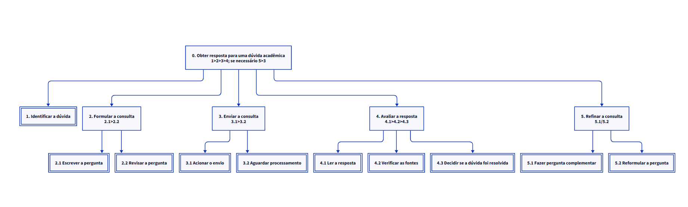
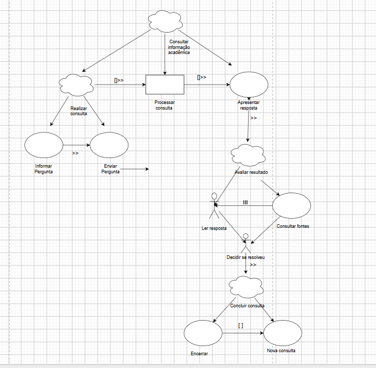

# Entrega 5 — Análise de tarefas: HTA, GOMS e CTT

**Data:** 21/09/2026 
**Status:** 🟨 em andamento 
**Responsabilidade:** cada integrante modela pelo menos 1 HTA, 1 GOMS e 1 CTT. As três técnicas podem abordar a mesma funcionalidade ou funcionalidades distintas, conforme a orientação da disciplina.

## Objetivo da atividade

Modelar tarefas importantes sob perspectivas complementares: decomposição hierárquica (HTA), estrutura de metas/métodos/operações (GOMS) e relações temporais entre tarefas (CTT). O diagrama deve ser acompanhado de interpretação textual.

## Para projetos cujo TCC não previa interface

Modele **tarefas humanas relacionadas ao uso da contribuição técnica**, e não a implementação interna do algoritmo. Exemplos de boas tarefas para análise:

- investigar uma consulta de baixo desempenho;
- configurar uma análise e selecionar parâmetros;
- submeter um dataset e verificar sua validade;
- acompanhar uma execução demorada;
- comparar dois resultados/modelos;
- interpretar uma recomendação e decidir se a aceita;
- localizar uma execução anterior usando busca/filtros;
- gerar e compartilhar um relatório;
- administrar papéis/permissões quando isso for parte do trabalho real;
- revisar um alerta e registrar uma decisão.

Um CRUD pode gerar tarefas relevantes, mas “cadastrar usuário” só merece modelagem se tiver significado no domínio (papéis, validações, riscos, permissões, dependências).

## Seleção das tarefas

| ID | Tarefa | Persona/cenário de origem | Frequência/criticidade | Autor responsável |
|---|---|---|---|---|
| T01 | Obter resposta para uma dúvida acadêmica | P01/C01 | Alta frequência / Alta criticidade | Matheus Dourado Valle — 22.224.023-6 |
| T02 | Formular e enviar uma consulta ao assistente | P01/C01 | Alta frequência / Alta criticidade | Matheus Dourado Valle — 22.224.023-6 |
| T03 | Consultar a resposta e verificar as fontes apresentadas | P01/C01 | Alta frequência / Alta criticidade | Matheus Dourado Valle — 22.224.023-6 |

> Priorize tarefas necessárias para que o usuário alcance objetivos centrais. Não desperdice a modelagem em ações triviais isoladas, como “clicar em login”, se o objetivo relevante é maior. Da mesma forma, não modele o funcionamento interno do algoritmo como se fosse uma tarefa humana.

---

## HTA — T01 Obter resposta para uma dúvida acadêmica

**Autor(a):** Matheus Dourado Valle — 22.224.023-6

### Descrição da tarefa

O objetivo do estudante é esclarecer uma dúvida acadêmica ou administrativa utilizando o assistente virtual.

A tarefa começa quando o estudante identifica uma necessidade de informação, como uma dúvida relacionada a matrícula, notas, documentos, estágio, calendário acadêmico ou outros serviços da instituição.

A tarefa é concluída quando o estudante recebe uma resposta, analisa seu conteúdo e verifica se a informação apresentada resolveu sua dúvida. Caso a resposta não seja suficiente, o estudante pode reformular a pergunta ou realizar uma pergunta complementar.

### Diagrama

### Decomposição e planos

| ID | Objetivo/operação | Plano/ordem | Problema ou decisão de design observada |
|---|---|---|---|
| 0 | Obter resposta para uma dúvida acadêmica | 1 > 2 > 3 > 4. Se a dúvida não for resolvida, executar 5 e retornar a 3. | O fluxo deve permitir continuar a conversa sem exigir que o estudante inicie uma nova interação. |
| 1 | Identificar a dúvida | Executar antes de 2. | O estudante pode não conhecer os termos institucionais adequados para formular sua dúvida. |
| 2 | Formular a consulta | 2.1 > 2.2 | O sistema deve permitir perguntas em linguagem natural. |
| 2.1 | Escrever a pergunta | Operação | Perguntas muito vagas podem gerar respostas pouco específicas. |
| 2.2 | Revisar a pergunta | Operação | O estudante deve conseguir editar livremente o texto antes do envio. |
| 3 | Enviar a consulta | 3.1 > 3.2 | O sistema deve fornecer feedback de que a pergunta foi enviada e está sendo processada. |
| 3.1 | Acionar o envio | Operação | A ação de envio deve ser facilmente identificada na interface. |
| 3.2 | Aguardar o processamento | Operação | A ausência de feedback durante a espera pode fazer o estudante interpretar que houve um erro. |
| 4 | Avaliar a resposta | 4.1 > 4.2 > 4.3 | A resposta e suas fontes devem ser apresentadas de forma clara. |
| 4.1 | Ler a resposta | Operação | Respostas excessivamente longas podem dificultar a identificação da informação principal. |
| 4.2 | Verificar as fontes apresentadas | Operação | As fontes devem ser facilmente identificáveis e relacionadas à informação apresentada. |
| 4.3 | Decidir se a dúvida foi resolvida | Operação | O estudante deve conseguir continuar a conversa caso ainda tenha dúvidas. |
| 5 | Refinar a consulta | 5.1 / 5.2 | O estudante escolhe entre complementar a pergunta anterior ou reformular sua consulta. |
| 5.1 | Fazer pergunta complementar | Operação | O histórico da conversa deve ser mantido para preservar o contexto. |
| 5.2 | Reformular a pergunta | Operação | O estudante deve conseguir realizar uma nova tentativa sem perder o histórico anterior. |

**Verificação do HTA:**

- O objetivo 0 representa uma meta do usuário?  
  Sim. A meta principal é obter uma resposta que esclareça uma dúvida acadêmica ou administrativa.

- As subtarefas são necessárias e suficientes?  
  Sim. Elas representam desde a identificação da dúvida até a avaliação da resposta recebida.

- Os **planos** indicam ordem, alternativa, repetição ou condição?  
  Sim. O fluxo principal é sequencial e existe uma condição de repetição quando a resposta não resolve a dúvida.

- A decomposição parou em nível útil para projeto de interação?  
  Sim. A decomposição termina em operações diretamente relacionadas à interação do estudante com o assistente.

---

## GOMS — T02 Formular e enviar uma consulta ao assistente

**Autor(a):** Matheus Dourado Valle — 22.224.023-6

### Goal

`GOAL 0: formular e enviar uma consulta ao assistente virtual`

### Métodos, operadores e regras de seleção

**GOAL 1: definir a consulta a ser realizada**

**METHOD 1.A:** realizar uma nova consulta  
**(SEL. RULE:** utilizar quando a dúvida for independente das mensagens anteriores ou quando o estudante estiver iniciando uma nova conversa.)

- **OP. 1.A.1:** identificar mentalmente a informação acadêmica desejada;
- **OP. 1.A.2:** localizar visualmente o campo de entrada da pergunta;
- **OP. 1.A.3:** apontar o cursor para o campo de entrada;
- **OP. 1.A.4:** clicar no campo de entrada;
- **OP. 1.A.5:** digitar a pergunta;
- **OP. 1.A.6:** revisar o texto digitado;
- **OP. 1.A.7:** decidir se a pergunta está suficientemente clara.

**METHOD 1.B:** realizar uma pergunta complementar  
**(SEL. RULE:** utilizar quando a nova dúvida depender de uma pergunta ou resposta já existente no histórico da conversa.)

- **OP. 1.B.1:** examinar as mensagens anteriores;
- **OP. 1.B.2:** identificar a resposta relacionada à nova dúvida;
- **OP. 1.B.3:** determinar qual informação ainda está faltando;
- **OP. 1.B.4:** localizar visualmente o campo de entrada;
- **OP. 1.B.5:** apontar o cursor para o campo;
- **OP. 1.B.6:** clicar no campo;
- **OP. 1.B.7:** digitar a pergunta complementar;
- **OP. 1.B.8:** revisar a pergunta considerando o contexto da conversa.

---

**GOAL 2: enviar a consulta ao assistente**

**METHOD 2.A:** enviar utilizando o botão de envio  
**(SEL. RULE:** utilizar quando o usuário optar pela interação visual com o botão disponível na interface.)

- **OP. 2.A.1:** localizar visualmente o botão de envio;
- **OP. 2.A.2:** apontar o cursor para o botão;
- **OP. 2.A.3:** clicar no botão de envio;
- **OP. 2.A.4:** verificar se a pergunta foi adicionada ao histórico;
- **OP. 2.A.5:** observar o feedback de processamento apresentado pelo sistema.

**METHOD 2.B:** enviar utilizando o teclado  
**(SEL. RULE:** utilizar quando o campo de entrada estiver ativo e o usuário preferir enviar a consulta pelo teclado.)

- **OP. 2.B.1:** verificar se o cursor permanece ativo no campo de entrada;
- **OP. 2.B.2:** pressionar a tecla de envio definida pela interface;
- **OP. 2.B.3:** verificar se a pergunta foi adicionada ao histórico;
- **OP. 2.B.4:** observar o feedback de processamento apresentado pelo sistema.

---

**GOAL 3: confirmar que a consulta foi enviada corretamente**

**METHOD 3.A:** verificar o estado da conversa após o envio  
**(SEL. RULE:** executar após a utilização de qualquer método do GOAL 2.)

- **OP. 3.A.1:** examinar a mensagem enviada no histórico;
- **OP. 3.A.2:** verificar se o sistema apresenta indicação de processamento;
- **OP. 3.A.3:** identificar eventual mensagem de erro;
- **OP. 3.A.4:** decidir se é necessário reenviar ou corrigir a consulta.

> Não chame qualquer passo de “método”. Em GOMS, métodos são sequências alternativas capazes de atingir uma meta; regras de seleção explicam quando escolher entre eles.

---

---

## CTT — T03 Consultar a resposta e verificar as fontes apresentadas

**Autor(a):** Matheus Dourado Valle — 22.224.023-6

### Descrição

A tarefa representa a interação entre o estudante e o assistente virtual desde a realização de uma consulta até a avaliação da resposta apresentada.

Inicialmente, o estudante informa e envia sua pergunta. A consulta é então processada pelo sistema e a resposta é apresentada ao estudante.

Após receber a resposta, o estudante pode ler seu conteúdo e consultar as fontes apresentadas. Essas duas tarefas não possuem uma ordem obrigatória e podem ser realizadas conforme a necessidade do usuário.

Em seguida, o estudante decide se a dúvida foi resolvida. Caso a informação seja suficiente, a consulta é encerrada. Caso contrário, o estudante pode realizar uma nova consulta e continuar a interação com o assistente.

### Diagrama

### Legenda e relações temporais usadas

#### Tipos de tarefa

| Representação | Tipo de tarefa | Significado no modelo |
|---|---|---|
| Nuvem | Tarefa abstrata | Representa uma composição de tarefas utilizada para organizar a decomposição. |
| Retângulo | Tarefa do sistema | Representa uma atividade executada automaticamente pelo sistema. |
| Ator | Tarefa do usuário | Representa uma atividade realizada pelo estudante fora da interação direta com o sistema. |
| Elipse | Tarefa interativa | Representa uma interação entre o estudante e o sistema. |

#### Relações temporais

| Operador/relação | Significado no diagrama | Exemplo no modelo |
|---|---|---|
| `>>` | Ativação: a segunda tarefa somente pode ser iniciada após a conclusão da primeira. | Após apresentar a resposta, o estudante pode iniciar a avaliação do resultado. |
| `[ ] >>` | Ativação com passagem de informação: além da ordem entre as tarefas, a informação produzida pela primeira é utilizada pela segunda. | A consulta realizada pelo estudante é utilizada pelo sistema para processar a pergunta e produzir a resposta. |
| `[ ]` | Escolha entre tarefas alternativas. | Ao concluir a consulta, o estudante pode encerrar a interação ou realizar uma nova consulta. |
| 'III' | Concorrência: as tarefas podem ser realizadas em qualquer ordem ou simultaneamente. | O estudante pode ler a resposta e consultar as fontes sem uma ordem obrigatória. |

No modelo proposto, são utilizados os quatro tipos de tarefa apresentados pela notação CTT:

- **Tarefa do usuário:** ler a resposta e decidir se a dúvida foi resolvida.
- **Tarefa do sistema:** processar a consulta enviada.
- **Tarefa interativa:** informar a pergunta, enviar a pergunta, visualizar a resposta, consultar as fontes, encerrar a consulta ou iniciar uma nova consulta.
- **Tarefa abstrata:** organizar atividades maiores, como consultar uma informação acadêmica, realizar a consulta, avaliar o resultado e concluir a consulta.

---

## Síntese da equipe

As modelagens evidenciaram que a interação com o assistente virtual não termina simplesmente quando uma resposta é apresentada. Para que o objetivo do estudante seja atingido, ele precisa conseguir formular sua dúvida, receber feedback do sistema, compreender a resposta, consultar as fontes utilizadas e decidir se a informação apresentada foi suficiente.

A análise HTA mostrou a importância de organizar a interação em etapas claras, desde a identificação e formulação da dúvida até a avaliação e eventual refinamento da consulta.

A análise GOMS evidenciou diferentes métodos disponíveis para realizar uma consulta, como iniciar uma nova pergunta ou utilizar o contexto de uma conversa existente, além de diferentes formas de realizar o envio. Isso reforça a necessidade de uma interface que ofereça caminhos simples e previsíveis para atingir o mesmo objetivo.

A análise CTT mostrou que algumas tarefas possuem dependências temporais claras, enquanto outras podem ocorrer sem uma ordem obrigatória. Em especial, a leitura da resposta e a consulta às fontes podem ocorrer de forma concorrente, enquanto a decisão de encerrar ou continuar a interação ocorre apenas após a avaliação da informação recebida.

A partir das modelagens, foram identificados como requisitos importantes para a interface:

- permitir consultas em linguagem natural;
- apresentar claramente o campo de entrada e a ação de envio;
- fornecer feedback durante o processamento da consulta;
- manter o histórico de perguntas e respostas;
- apresentar respostas de forma organizada e de fácil leitura;
- apresentar claramente as fontes utilizadas;
- permitir a consulta às fontes sem interromper a leitura da resposta;
- permitir perguntas complementares e novas consultas;
- permitir reformulação de perguntas;
- apresentar mensagens compreensíveis em situações de erro ou ausência de informação.

As principais tarefas que deverão ser representadas no protótipo e posteriormente avaliadas no teste de usabilidade serão:

- realizar uma nova consulta acadêmica;
- realizar uma pergunta complementar;
- interpretar a resposta apresentada;
- consultar as fontes utilizadas;
- decidir se a informação resolveu a dúvida;
- continuar a interação quando a resposta inicial não for suficiente.

## Checklist

- [ ] Cada integrante produziu ao menos 1 HTA, 1 GOMS e 1 CTT.
- [x] Cada artefato identifica autor e tarefa.
- [x] Diagramas são legíveis e possuem fonte editável quando possível.
- [x] HTA contém planos, não apenas árvore de tópicos.
- [x] GOMS distingue Goals, Operators, Methods e Selection Rules.
- [x] CTT usa operadores temporais e tipos de tarefa coerentes.
- [x] Há texto explicando cada diagrama.
- [ ] Tarefas estão ligadas a cenários/personas na rastreabilidade.
- [x] Em TCC técnico, as tarefas descrevem o que a pessoa faz com a contribuição/resultados, não passos internos do código.
- [x] CRUDs, relatórios, filtros e atividades administrativas foram escolhidos por relevância ao objetivo do usuário.
